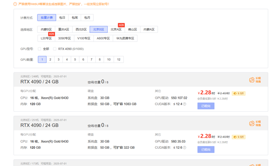

# **AutoDL**使用方法

本文档主要介绍如何使用AutoDL云平台来实现一个通用的Lora微调大语言模型的方法。仅供学习参考使用，请以实际情况为准。

##  一、AutoDL云服务器使用方法：

为什么要使用云服务器呢？考虑到100个人可能会有100种环境问题，为了解决同学们在安装环境上出现的各种问题，干脆直接使用云服务器算了。这里面有已经搭建好的环境，只需要自己选择相应的环境就行。下面将展示如何使用AutoDL云服务器租一台4090。

**打开AutoDL官网并注册账号**

AutoDL官网：https://www.autodl.com/login?url=/console/homepage/personal

怎么注册账号大家自己操作就好。

同学们完成注册后直接登录进去别忘记了注册一个学生会员，会员租卡可以打95折

https://www.autodl.com/docs/

**认识AutoDL平台**

这就是AutoDL平台的界面：

1是帮助文档，大家在使用过程中遇到什么问题可以参考这个文档。

2是算力市场，一般租卡都在这里（要用卡的话建议每天的早上8点前去租，晚了可能没了）

3是容器实例，用来管理你租的服务器，大家租了服务器用完了记得及时释放掉，不然会一直扣费。

**算力市场**

我们租卡一般都在算力市场，这里的卡很便宜，4090大概2块左右一个小时，其他地区的卡价格好像也不同，大家想租卡的话记得早点去抢。这里也有一些大算力显存的卡（H20-NVLink / 96 GB 7.58元/h、A800-80GB / 80 GB 5.98元/h）同学们可以根据自己的需求租。

**容器实例**

这里是自己租的服务器管理界面，每租一张卡都会在这里看到，当天用完后记得在这里关机；每个容器里面的数据只会保存15天，大家做完实验有重要的数据记得及时保存，不然它会自动释放掉。

介绍完上面常用的信息，大家遇到其他的信息可以去查看帮助文档，下面将演示一下怎么租一台服务器

**租云服务器**

首先打开算力市场，找到自己想要租的卡的型号，例如我在这里要租一张4090：

大家选卡的时候要估计一下自己要用多少的数据盘（存储空间），一般租卡的时候都会显示出来，例如这张4090的数据盘有50g，想要扩容的话可以点击下面的数据盘来扩大相应的存储空间。

然后是选择镜像，这里提供了几种深度学习的框架，同学们可以根据实际需求进行选择。

选好后就可以创建开机了：

成功租好后可以去容器实例中查看自己租的卡：

这样就是租成功了

**使用云服务**

官网这里提供了两种方法：一种是直接使用JupyterLab工具：选里面的终端，就可以直接使用了，文件可以存在（autodl-tmp）里面。

另一种就是通过ssh连接，把ssh的登录指令输入到终端：ssh -p 46464 root@connect.nmb1.seetacloud.com然后输入密码：j8ge5+pjyj8d.......

**关机释放实例**

用完后记得关机，不然会持续扣费：

释放实例就是把服务器里面的数据都释放掉，一般会保存15天后自动释放，当天有没做完的实验可以不释放实例，第二天可以接着之前的数据使用（不释放实例不会扣钱，但是不关机会扣钱），额外申请的数据盘另外算钱。

**克隆实例**

克隆实例可以把数据迁移到另一个卡上，但要注意之前租的卡上的环境在另一个卡上支不支持（比如说H20上建立了一个pytorch2.5的环境，要克隆实例的话也只能选支持pytorch2.5的卡）

 

假如今天没租到之前的卡，但是想在之前的卡上做实验，那么就只能将这个卡上的数据迁到另一张卡上，但是容器克隆只能支持同地区的克隆。

 