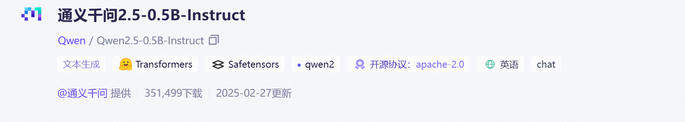

### 1.模型蒸馏概述

#### 1.1 背景与目的

大型语言模型（LLM）在自然语言处理任务中表现出色，但其庞大的参数量导致高计算成本和部署门槛。例如，DeepSeek-R1 671B模型拥有6710亿参数，需要至少1.4TB显存进行推理，这对企业的硬件资源和成本投入要求极高。 

通过知识蒸馏技术，将大型模型的知识迁移至小型模型，实现模型轻量化，降低计算资源需求，同时保留核心推理能力。例如，DeepSeek-R1-Distill-Qwen-7B模型在保留90%以上性能的同时，显著降低了推理成本。

#### 1.2 适用场景

边缘计算、企业私有化部署、移动端应用等资源受限环境。例如，DeepSeek的蒸馏版模型适用于实时生成文本的场景，如简单的聊天和问答，以及嵌入式系统或物联网设备。

Deepseek已经开源了几个开源模型：


接下来将演示Deepseek-R1模型蒸馏的具体实现过程

### 2.Deepseek蒸馏技术

#### 2.1 蒸馏技术定义与原理

知识蒸馏（Knowledge Distillation）是一种模型压缩技术，其核心思想是将大型、复杂的教师模型所掌握的知识迁移到较小、简单的学生模型中。这种方法使学生模型能够在保持高性能的同时，显著降低计算成本和内存占用。


在知识蒸馏过程中，教师模型首先对训练数据进行预测，生成软标签（Soft Targets），这些软标签包含了教师模型对各类别的置信度信息。然后，学生模型通过学习这些软标签，捕捉教师模型的知识结构，从而提高自身的泛化能力。

#### 2.2 核心步骤

**训练教师模型**：首先，训练一个性能优异但计算复杂度较高的教师模型。 

**生成软标签**：使用教师模型对训练数据进行预测，得到每个样本的预测概率分布（软目标），这些概率分布包含了模型对每个类别的置信度信息。 

**定义损失函数**：设计损失函数以衡量学生模型输出与教师模型输出之间的差异，通常采用软标签损失（如Kullback-Leibler散度）和硬标签损失（如交叉熵损失）的组合。 

**训练学生模型**：通过最小化上述损失函数，训练计算复杂度较低的学生模型，使其学习教师模型的知识结构。


接下来将演示以Qwen/Qwen2.5-0.5B-Instruct模型为教师模型进行蒸馏的方法。

### 3 蒸馏Qwen2.5-1.5B-Instruct模型步骤

#### 3.1 安装环境

本实验是在PyTorch 2.5.1  Python 3.12  Cuda 12.4 环境下进行的，GPU和CPU配置详细如下图：


为了不造成环境冲突，建议先创建一个虚拟环境：

```Python
conda create deepseek -n python=3.12
```

然后选择y创建环境，创建好后激活环境：

```Python
conda activate deepseek
```

设置学术加速（可选）

```Python
source /etc/network_turbo
```

安装Llama-Factory，我们需要使用Llama-Factory进行全量指令微调，因此这里需要提前安装Llama- Factory。

```Python
cd /root/autodl-tmp
git clone --depth 1 https://github.com/hiyouga/LLaMA-Factory.git
```

安装相关依赖库

```
cd /root/autodl-tmp/LLaMA-Factory
pip install -e ".[torch,metrics]" 
pip install deepspeed
```

在安装依赖库时，可能会耗费一段时间，请耐心等待一下，也可以通过添加镜像源来加快下载速度：

```
pip install -e ".[torch,metrics]" -i https://pypi.tuna.tsinghua.edu.cn/simple
```


#### 3.2 下载模型

Qwen2.5-0.5B-Instruct 是阿里巴巴推出的通义千问 2.5（Qwen2.5）系列中的一款指令微调语言模型，拥有 5 亿参数。  相较于前代模型，Qwen2.5 在知识储备、编程能力和数学能力方面有了显著提升。

在此实验中，我们以 Qwen2.5-0.5B-Instruct 模型为基础进行蒸馏，省去了冷启动的 SFT（监督微调）过程。由于 Qwen 系列模型本身性能优异，我们仅执行后期的 SFT 阶段，省略了强化学习（RL）阶段。这种方法提高了蒸馏效率，但由于并非从基础模型开始蒸馏，因此模型推理能力的提升可能有限。



ModelScope提供了该模型的下载方法。

在下载前，先通过如下命令安装ModelScope，然后下载完整的模型库。

```Python
pip install modelscope
mkdir ./Qwen2.5_0.5B_instruct
```

然后运行如下命令开始下载模型

```
modelscope download --model Qwen/Qwen2.5-0.5B-Instruct --local_dir /root/autodl-tmp/Qwen2.5_0.5B_instruct
```

#### 3.3 构建数据集

由于Deepseek-R1是一个带有思维链推理的模型，所以我们在进行模型微调数据集的时候也要准备一个带有CoT格式的数据集。数据集质量的高低将直接影响最终模型能力的好坏。

下面是一些常见的CoT数据集：

**AI-MO/NuminaMath-CoT**是一个著名的数学问答数据集，同时包含了数学问题，问题的解决思路（think部分）和问题的最终答案。


数据集链接：[AI-MO/NuminaMath-CoT · Datasets at Hugging Face](https://huggingface.co/datasets/AI-MO/NuminaMath-CoT)

**RUC-AIBOX/long_form_thought_data_5k** 是一个由中国人民大学 AI Box 实验室于 2024 年发布的数据集，旨在增强大型语言模型（LLM）的推理能力。 


数据集链接：[RUC-AIBOX/long_form_thought_data_5k · Datasets at Hugging Face](https://huggingface.co/datasets/RUC-AIBOX/long_form_thought_data_5k?row=0)

**codeparrot/apps**是一个用于编程任务的基准数据集，包含了10,000 个问题，旨在评估语言模型生成代码的能力，特别是从自然语言描述中生成代码的能力。它为基于自然语言的代码生成、自动编程和相关任务的研究提供了一个标准化的测试平台。


数据集链接：[codeparrot/apps · Datasets at Hugging Face](https://huggingface.co/datasets/codeparrot/apps)

**BAAI/TACO**是一个用于评估语言模型从自然语言描述生成代码能力的基准数据集。它包含了 26,443个编程问题，配有Python代码解决方案，适用于代码生成、自然语言理解和问题求解等任务。


数据集链接：[BAAI/TACO · Datasets at Hugging Face](https://huggingface.co/datasets/BAAI/TACO)

#### 3.4 数据集清理

在进行模型蒸馏之前，我们需要使用教师模型生成对应的软标签，即使用Deepseek-R1模型推理多个数据集的结果，输入问题，让模型输出思维链和模型的推理结果。这部分数据就是教师模型生成的结果，让学生模型去学习这些信息，从而让教师模型的“知识”灌输给学生模型。

去Deepseek官网获取API密钥（[DeepSeek 开放平台](https://platform.deepseek.com/api_keys)）

```
# Please install OpenAI SDK first: `pip3 install openai`

from openai import OpenAI

client = OpenAI(api_key="<DeepSeek API Key>", base_url="https://api.deepseek.com")

response = client.chat.completions.create(
    model="deepseek-chat",
    messages=[
        {"role": "system", "content": "You are a helpful assistant"},
        {"role": "user", "content": "Hello"},
    ],
    stream=False
)

print(response.choices[0].message.content)
```

在获取训练数据列表文件后，我们需要将其转换为统一格式。这一步可以使用上述的 DeepSeekAPI 代码进行重写，并利用 DeepSeekV3 评估 R1 模型的输出结果与标准答案之间的差距。对于回答正确的样本，将其纳入全量指令微调，而对于错误的回答，则引导模型创建思维链，并将其融入后续的强化学习训练阶段。

在完成上述操作后，将数据集打包为一个训练文件，并上传到data目录下。


#### 3.5 修改配置文件 

本次模型的训练将借助Llama-Factory进行，首先需要在LLama-Factory中注册自定义数据集，找到/root/autodl-tmp/LLaMA-Factory-main/data/dataset_info.json文件


然后在文件的末尾加上这段代码：

```
"Distill":{
    "file_name":"/root/autodl-tmp/data/soft_data_distill.arrow",
    "formatting":"sharegpt",
    "columns":{
      "messages":"conversations",
      "system":"system"
    },
    "tags":{
      "role_tag":"from",
      "content_tag":"value",
      "user_tag":"user",
      "assistant_tag":"assistant"
    }
  }
```

保存后找到训练配置文件：/root/autodl-tmp/LLaMA-Factory-main/examples/train_full/qwen2vl_full_sft.yaml  下面的模型路径，数据集，参数保存路径修改为自己的路径。


其他参数的配置可以参考：

```
### model
model_name_or_path: /root/autodl-tmp/qwen2.5-0.5B
image_max_pixels: 262144
video_max_pixels: 16384
trust_remote_code: true

### method
stage: sft
do_train: true
finetuning_type: full
freeze_vision_tower: true  # choices: [true, false]
freeze_multi_modal_projector: true  # choices: [true, false]
train_mm_proj_only: false  # choices: [true, false]
deepspeed: examples/deepspeed/ds_z3_config.json  # choices: [ds_z0_config.json, ds_z2_config.json, ds_z3_config.json]

### dataset
dataset: "Distill"
template: qwen
cutoff_len: 8192
max_samples: 100000
overwrite_cache: true
preprocessing_num_workers: 16
dataloader_num_workers: 4

### output
output_dir: /root/autodl-tmp/qwen2.5-0.5B/output
logging_steps: 10
save_steps: 500
plot_loss: true
overwrite_output_dir: true
save_only_model: false

### train
per_device_train_batch_size: 1
gradient_accumulation_steps: 12
learning_rate: 1.0e-5
num_train_epochs: 3.0
lr_scheduler_type: cosine
warmup_ratio: 0.1
bf16: true
ddp_timeout: 180000000
resume_from_checkpoint: null

```

#### 3.6 模型训练

至此，训练前的准备工作都已经完成了，运行以下命令即可开始训练：

```
FORCE_TORCHRUN=1 NNODES=1 NODE_RANK=0 MASTER_PORT=29501 llamafactory-cli train /root/autodl-tmp/LLaMA-Factory-main/examples/train_full/qwen2vl_full_sft.yaml
```

**开始训练：**


显存共占用51G左右：


在H20机器下训练大概需要5个半小时：


#### 3.7 蒸馏模型推理

训练完成后，模型会保存到我们指定的路径下，使用以下代码即可进行推理

```
from modelscope import AutoModelForCausalLM, AutoTokenizer

model_path = "/root/autodl-tmp/Qwen2.5-0.5B-Distill"
# 加载模型
model = AutoModelForCausalLM.from_pretrained(
    model_path,
    torch_dtype="auto",
    device_map="auto",
    low_cpu_mem_usage=True
)

# 加载分词器
tokenizer = AutoTokenizer.from_pretrained(model_path)
while True:
    prompt = input("用户：")
    if prompt.strip() == "quit":
        break
    # 构造对话消息
    message = [
        {"role": "system", "content": "你是一名助人为乐的助手。"},
        {"role": "user", "content": prompt}
    ]
    # 应用聊天模板
    text = tokenizer.apply_chat_template(
        message,
        tokenize=False,
        add_generation_prompt=True
    )
    # 将输入转换为模型输入格式
    model_inputs = tokenizer([text], return_tensors="pt").to(model.device)
    # 生成文本
    generated_ids = model.generate(
        **model_inputs,
        max_new_tokens=10000
    )
    # 提取生成的文本
    generated_ids = [
        output_ids[len(input_ids):] for input_ids, output_ids in zip(model_inputs.input_ids, generated_ids)
    ]
    response = tokenizer.batch_decode(generated_ids, skip_special_tokens=True)[0]
    # 输出响应
    print(response)
```


