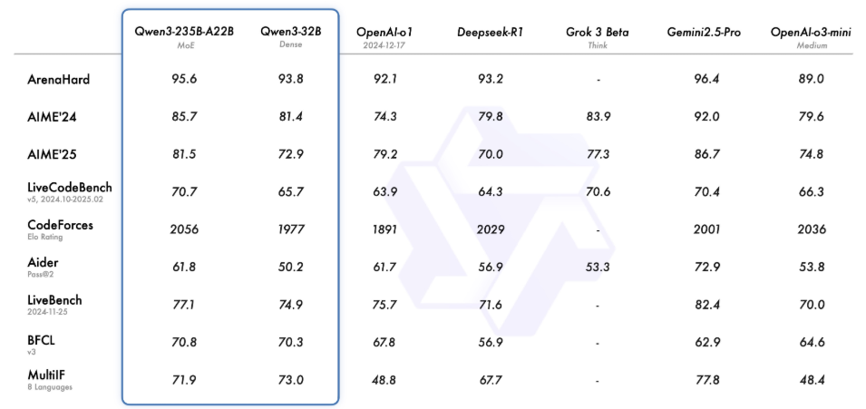
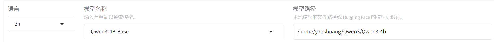

# 微调Qwen3

## Qwen3简介

### Qwen3亮点

​	

​	Qwen3是阿里通义实验室最近开源的大语言模型，发布时便登顶了开源LLM榜单第一名。同时，Qwen系列模型也超越LLaMA，成为了HuggingFace上最受欢迎的开源LLM。

​	Qwen3在公布后就展现出了惊人的效果，在多个任务的测评中，Qwen3-235B的能力已经超过了Openai-o1、DeepseekR1等模型，可以说，不论是进行研究学习，还是应用落地，Qwen已经逐渐成为开发者的最优选项之一。



​	Qwen3 作为 Qwen 系列中的最新一代大型语言模型，提供了一系列密集型和专家混合（MoE）模型。基于广泛的训练，Qwen3 在推理、指令执行、代理能力和多语言支持方面取得了突破性进展，具有以下关键特性：

- **在同一模型中独特地支持思考模式**（用于复杂的逻辑推理、数学和编码）和**非思考模式**（用于高效的通用对话）之间的无缝切换，确保在各种场景下都能表现出色。

- **显著增强了其推理能力**，在数学、代码生成和常识逻辑推理方面超过了之前的 QwQ（思考模式）和 Qwen2.5 指令模型（非思考模式）。

- **卓越的人类偏好对齐**，在创意写作、角色扮演、多轮对话和指令执行方面表现出色，提供了更加自然、吸引人和沉浸式的对话体验。

- **擅长代理能力**，能够在思考模式和非思考模式下精确集成外部工具，并在复杂的基于代理的任务中达到开源模型中的领先性能。

- **支持 100 多种语言和方言**，具备强大的**多语言指令执行**和**翻译**能力。

  

本案例以演示为主，将使用Qwen3-4B模型作为基座模型进行微调

**Qwen3-4B** 具有以下特点：

- 类型：因果语言模型
- 训练阶段：预训练 & 后训练
- 参数数量：40 亿
- 非嵌入参数数量：36 亿
- 层数：36
- 注意力头数（GQA）：Q 为 32，KV 为 8
- 上下文长度：原生 32,768 和 [使用 YaRN 的 131,072 个令牌](https://www.modelscope.cn/models/Qwen/Qwen3-4B/summary#processing-long-texts)。

## 微调

这张图系统性地梳理了近年来参数高效微调（Parameter-Efficient Fine-Tuning, PEFT）技术的发展脉络，整体趋势表明，微调方法正朝着**更轻量、更灵活、更统一**的方向发展，LoRA 系列成为最具活力和影响力的核心分支。该图不仅展示了方法的时间演进，也揭示了各类方法之间的继承和融合关系。

PEFT的发展也为大语言模型的微调发展奠定了基础。


大模型微调是一种轻量级的微调方法，专门针对大语言模型设计（例如Qwen，LLama，BERT等），目的是：

只训练模型中某些位置插入的少量低秩矩阵（称为 LoRA 层），而**冻结原始大模型的所有参数**，从而节省：

- ✅ 显存
- ✅ 训练时间
- ✅ 存储空间


本案例使用的训练框架是LLama-Factory:[hiyouga/LLaMA-Factory: Unified Efficient Fine-Tuning of 100+ LLMs & VLMs (ACL 2024)](https://github.com/hiyouga/LLaMA-Factory)


**LLaMA-Factory** 是一个开源的、支持各种大语言模型微调的框架，支持如：

- ✅ LLaMA / LLaMA2 / LLaMA3

- ✅ Qwen 系列（如 Qwen1.5、Qwen3）

- ✅ ChatGLM、Baichuan、Yi 等

  

### 准备工作

#### 安装环境

为了不造成环境冲突，建议先创建一个虚拟环境：

```Bash
conda create -n llamafactory python=3.11
```

然后选择y 创建环境，创建好后激活环境：

```bash
conda activate llamafactory
```

创建好虚拟环境后，从LLama-Factory的github官网上下载项目

```bash
git clone --depth 1 https://github.com/hiyouga/LLaMA-Factory.git
```

在安装依赖库时，可能会耗费一段时间，请耐心等待一下，也可以通过添加镜像源来加快下载速度：

```bash
cd LLaMA-Factory
pip install -e ".[torch,metrics]" -i https://pypi.tuna.tsinghua.edu.cn/simple
pip install unsloth -i https://pypi.tuna.tsinghua.edu.cn/simple
```

#### 下载模型

本案例的数据集和模型都是从modelscope上下载的

安装modelscope依赖库：

```bash
pip install modelscope
```

创建一个目录用于存储模型文件：

```bash
mkdir Qwen3-4b
```

运行下面命令下载模型

```bash
modelscope download --model Qwen/Qwen3-4B --local_dir /root/autodl-tmp/Qwen3-4B
```

#### 下载数据集

由于Qwen3是一个混合推理的模型，故在准备训练数据集的时候需要涉及两个类型的数据集：带思维链的数据集和不带思维链的数据集。

在这里本案例使用的带思维链数据集是 [delicate_medical_r1_data](https://modelscope.cn/datasets/krisfu/delicate_medical_r1_data) 数据集，该数据集主要被用于医学对话模型。

该数据集由2000多条数据组成，每条数据包含Instruction、question、think、answer、metrics六列：


这里我们只取`question`、`think`、`answer`这三列：

- `question`：用户提出的问题，即模型的输入
- `think`：模型的思考过程。大家如果用过DeepSeek R1的话，回复中最开始的思考过程就是这个。
- `answer`：模型思考完成后，回复的内容。

我们的训练任务，便是希望微调后的大模型，能够根据`question`，给用户一个`think`+`answer`的组合回复，并且think和answer直接在网页展示上是有区分的。

不带思维链的数据集是：FineTome-100k · 数据集](https://www.modelscope.cn/datasets/AI-ModelScope/FineTome-100k/files)

该数据集是一个对话数据集，格式如下


这里我们取human的value作为question，gpt的value作为answer

其中answer是不带推理思维链的回答

下载数据集：

```bash
mkdir delicate_medical_r1_data
mkdir FineTome-100k

modelscope download --dataset krisfu/delicate_medical_r1_data --local_dir delicate_medical_r1_data
modelscope download --dataset AI-ModelScope/FineTome-100k --local_dir FineTome-100k
```

#### 处理数据

Qwen3有一套自己的tokenizer，其中包含了很多特殊的token用于标记用户输入和模型输出等，通过下面代码我们可以看到：

```python
from unsloth import FastLanguageModel
import torch
max_seq_length=8192
dtype=None

model,tokenizer=FastLanguageModel.from_pretrained(
    model_name="/home/yaoshuang/Qwen3/Qwen3-4b",
    max_seq_length=max_seq_length,
    dtype=dtype,
)

messages=[
    {"role":"user","content":"你好，好久不见！"}
]

text=tokenizer.apply_chat_template(
messages,
tokenize=False,
add_generation_prompt=True,
enable_thinking=False,#不启用思考
)
print(text)
```

处理数据格式如下


使用LLamaFactory训练框架的数据集格式是固定的，我们需要把不同的数据转换为符合LLamafactory训练的格式。

这里我们对两个数据集分别取1000条，通过下面代码进行格式的转换：

```python
import json
import pandas as pd
from datasets import Dataset
import os

# 读取 Parquet 文件
input_file = "/home/yaoshuang/Qwen3/FineTome-100k/data/train-00000-of-00001.parquet"
output_file = "/home/yaoshuang/Qwen3/delicate_medical_r1_data/Qwen3_train.jsonl"

# 读取前1000条数据
df = pd.read_parquet(input_file).head(1000)
alpaca_data = []


for index, row in df.iterrows():
    conversations = row['conversations'] 
    human_value = None
    gpt_value = None
    
    # 遍历 conversations 列表，提取 human 和 gpt 的 value
    for msg in conversations:
        if msg['from'] == 'human':
            human_value = msg['value']
        elif msg['from'] == 'gpt':
            gpt_value = msg['value']
   
    if human_value and gpt_value:
        alpaca_entry = {
            "instruction": f"<|im_start|>user\n{str(human_value)}<|im_end|>\n",
            "input": "",
            "output": f"<|im_start|>assistant\n<think>\n\n<think>\n{str(gpt_value)}"
        }
        alpaca_data.append(alpaca_entry)

# 将数据保存为 JSONL 文件
with open(output_file, 'a', encoding='utf-8') as f:
    for entry in alpaca_data:
        json.dump(entry, f, ensure_ascii=False)
        f.write('\n')

os.environ["SWANLAB_PROJECT"]="qwen3-sft-medical"
# PROMPT = "你是一个医学专家，你需要根据用户的问题，给出带有思考的回答。"
MAX_LENGTH = 2048


def dataset_jsonl_transfer(origin_path, new_path):
    """
    将原始数据集转换为大模型微调所需数据格式的新数据集
    """
    messages = []
    count=0
    # 读取旧的JSONL文件
    with open(origin_path, "r") as file:

        for line in file:
            
            if count >=1000 :
                break
            # 解析每一行的json数据
            data = json.loads(line)
            input = data["question"]
            output = f"<|im_start|>assistant\n<think>\n{data['think']}\n</think> \n {data['answer']}"
            message = {
                "instruction": f"<|im_start|>user\n{input}<|im_end|>\n",
                "input": "",
                "output": output,
            }
            messages.append(message)
            count+=1

    # 保存重构后的JSONL文件
    with open(new_path, "a", encoding="utf-8") as file:
        for message in messages:
            file.write(json.dumps(message, ensure_ascii=False) + "\n")

origin_path="/home/yaoshuang/Qwen3/delicate_medical_r1_data/r1_data_example.jsonl"
new_path="/home/yaoshuang/Qwen3/delicate_medical_r1_data/Qwen3_train.jsonl"
dataset_jsonl_transfer(origin_path,new_path)


```

处理后的数据集一共两千条：


处理完数据格式后，我们需要将自己的数据集注册到LLamafactory的数据集库中。

该数据集库位置如下：/root/autodl-tmp/LLaMA-Factory/data/dataset_info.json


然后在文件开头处添加以下代码：

```
"alpaca_Qwen3_train":{
    "file_name":"/home/yaoshuang/Qwen3/delicate_medical_r1_data/Qwen3_train.jsonl"
  },
```


#### 启动LLamafactory

我们在前面已经成功下载了LLamaFactory，直接通过以下命令进入WebUI界面

```
llamafactory-cli webui
```

若想切换端口：

```bash
export GRADIO_SERVER_PORT=8000
llamafactory-cli webui
```

启动成功后会弹出一个网页：


首先，导入前面已经下载好的模型，

选择zh(中文)，模型名称（Qwen3-4B-Base）模型的本地路径（/Qwen3/Qwen3-4b）



然后选择数据集，这里选择自己的注册的数据集：


在这里可以设置默认的超参数也可以自行调整合适的训练参数例如：LORA秩、LORA缩放系数、学习率等。


选择模型的结构保存路径，然后就可以开始训练了。


可以在WebUI上看到实时的训练进度：


同时LLamaFactory也提供了一个可视化的界面方便我们只管的观察训练的损失情况：


微调结束后，可以加载模型微调权重参数进行推理：


在推理时，我们可以选择相应的参数，让生成结果更加多样


注意：

*根据Qwen-3团队建议：*

1. 推理模式：temperature=0.6, top_p=0.95, top_k=20
2. 普通聊天模式：temperature=0.7, top_p=0.8, top_k=20

#### 推理结果

带思维链：


不带思维链：


#### 评估模型

我们从数据集中分出来500条作为测试集，微调前测试集结果如下：


下面是经过混合数据集微调后的测评结果：


对比两个测评结果我们可以发现：微调后的数据集相较于微调前的数据集性能上有较大的提升。