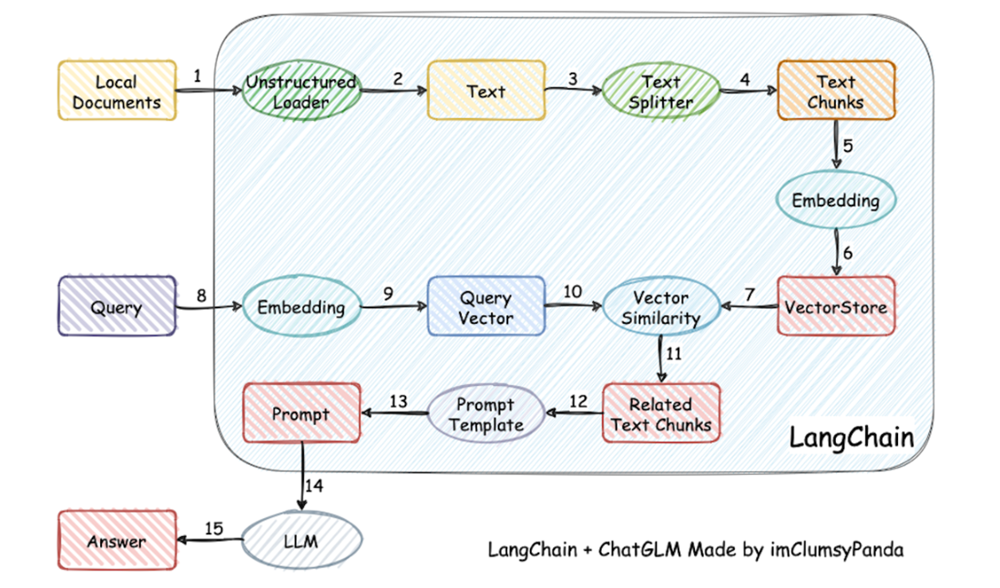
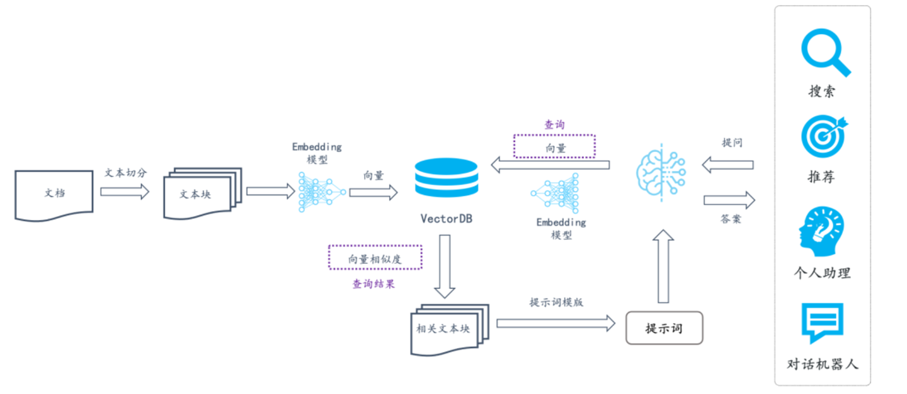
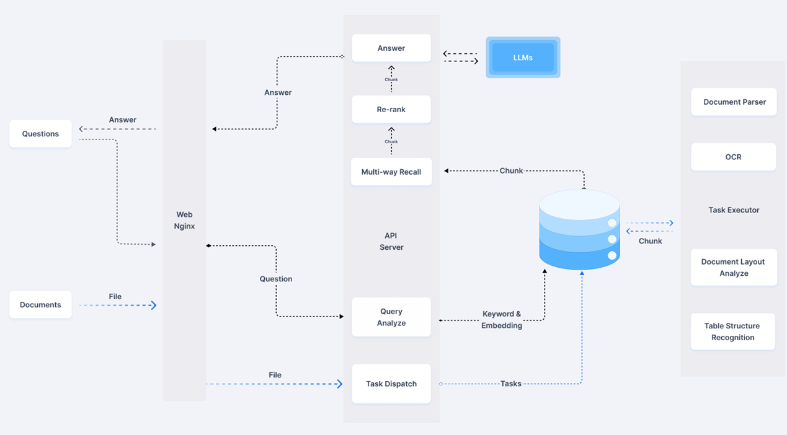
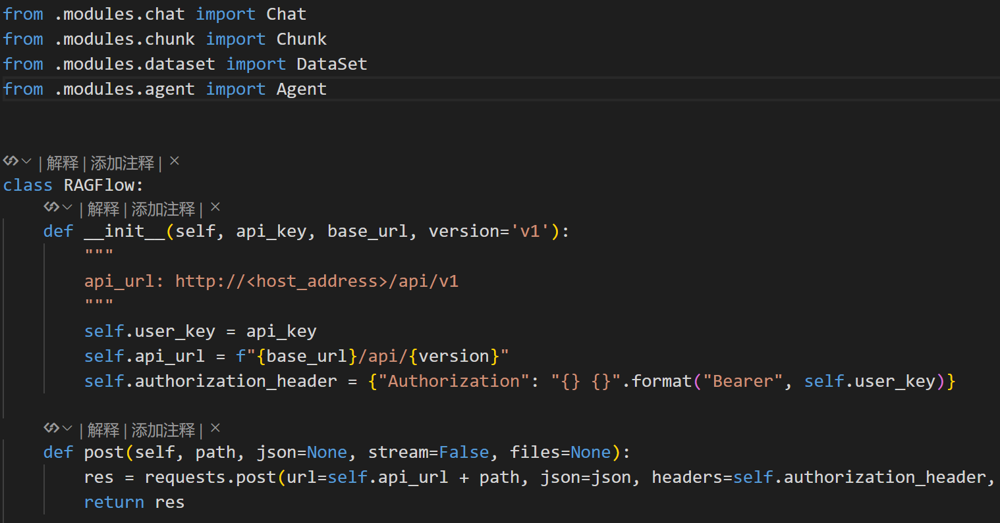
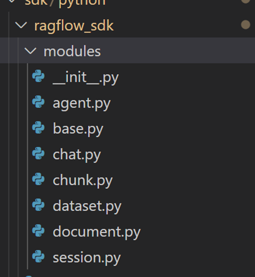

# RAGFLow 框架源码详解

RAGFlow是一个基于深度文档检索的开源RAG项目，目前已经斩获43Kstars

下面我们将从代码层面分析它的魅力在哪

## RAG理论概述

### RAG常规流程




LangChain 主要用于处理知识库的内容，以弥补大语言模型（LLM）无法直接在 prompt 中容纳大型文件的局限。它的核心功能是根据用户输入，从知识库中检索语义相似度最高的内容，并将其与用户问题一并传递给 LLM，以提升回答的精准度。在图示中，椭圆表示操作流程，方框表示数据流转。

整个流程分为两个主要阶段：

**第一阶段：文档处理与存储**

1. 导入文档并上传至后台，利用 `UnstructuredLoader` 解析文档内容，提取纯文本（Text）。
2. 对文本进行切割，按逗号、句号等分隔符拆分成多个小块（chunks），以便后续处理。
3. 采用嵌入（embedding）模型对文本块进行向量化，并将编码后的结果存入向量数据库（VectorStore）。

**第二阶段：查询与检索**

4. 用户输入问题后，系统同样使用嵌入模型对问题进行向量化。
5. 在向量数据库中检索与问题向量最相似的 Top-K 个文本块，并返回相关上下文信息。
6. 将用户问题与检索到的 K 个文本块合并，并填充至提示词模板（Prompt Template）。
7. 最终形成完整的输入并发送至 LLM，生成回答。

通过这一流程，LangChain 实现了高效的知识检索，使 LLM 能够基于外部知识库提供更加精准的回答。

**总的来说，RAG的信息检索主要包含两个步骤：**

​	1、向量数据库的构建（1-7步），首先对原始文件的信息进行预处理（包括文本切分切块，然后embedding为向量后存储在向量库中）。

​	2、用户查询（8-15步），通过对用户输入的问题进行处理，转化为问题向量后，获取向量库中的匹配信息，将与用户问题相关度最高的几个知识向量拼成Prompt，提供给大模型得到最终的输出结果

### RAG工作流

RAG在行业中的代名词都叫知识库，RAG的工作流图如下所示：



​	在很长一段时间内，RAG 在行业的代名词都叫知识库，上述的应用架构，不仅带火了向量数据库，也带火了以LangChain，LlamaIndex 为代表的中间件，它们负责处理上图中各个箭头背后的工作流。具体包括：

​	1、把用户的文档进行切分，然后再调用一个 Embedding 模型把切分好的文档生成为向量。  

​	2、把生成好的向量连同原始文档写入到向量数据库中。

​	3、查询时，将用户的提问也根据相同的 Embedding 模型生成向量，然后查询向量数据库返回 Top K 结果。

​	4、把 Top K 结果对应的文本拼成提示词交由大模型做最终的摘要和内容完成。

因此，整个架构图里核心部分是两个：

​	1、向量数据库：负责基于向量对用户的文档进行查询召回。

​	2、中间件：负责对文档的切分，并转成适合的向量。

​	向量能够提供语义召回，使得用户提问时无需匹配具体关键词，而是根据相似度返回最相关的答案。由于向量表征的粒度难以控制，需对用户文档进行适当切分，以平衡语义表达的精确性和完整性。这正是 LangChain、LlamaIndex 等中间件的核心功能。

## RAGFlow 框架源码

### RAGFlow系统框架



以上工作流可以分为 **文档处理** 和 **查询问答** 两条主线，通过模块化协作实现端到端任务：

#### **一、文档处理流程（Document Passer）**

**目标**：将非结构化文档（如图片、PDF）转化为结构化数据，供后续检索使用。
**适用场景**：用户上传合同、论文、报表等文件。

1. **OCR 文字识别**
   - 输入：扫描件/图片中的文字（如发票、手写笔记）。
   - 输出：机器可读的原始文本（无结构）。
2. **Document Layout Analyze 版面分析**
   - 识别文档的物理结构：标题、段落、表格、页眉/页脚的位置关系。
   - *例如*：将论文的“摘要”和“参考文献”区域分离。
3. **Table Structure Recognition 表格识别**
   - 解析表格的行列结构，提取单元格内容与表头关联。
   - *例如*：将财务报表中的“收入”和“支出”数据按行列映射。
4. **Chunk 语义分块**
   - 按语义将文本分割为逻辑块（如一个段落、一个表格）。
   - *例如*：将合同条款按“甲方义务”“乙方权利”分块。
5. **Task Executor 任务执行**
   - 将解析后的结构化数据存储至 **Documents/File** 系统，建立索引供检索。

#### **二、查询问答流程**

**目标**：理解用户问题，从文档中检索并生成精准答案。
**适用场景**：用户提问“合同中的违约金条款是什么？”

1. **Query Analyze 查询分析**
   - 解析用户意图：提取关键词（如“违约金”）和语义向量（Embedding）。
   - *例如*：将口语化提问“如果违约要赔多少钱”转化为结构化查询。
2. **Task Dispatch 任务分派**
   - 根据查询类型分配任务：
     - 简单关键词匹配 → 直接检索。
     - 复杂语义问题 → 调用多路召回。
3. **Multi-way Recall 多路召回**
   - **并行检索**：
     - **关键词匹配**：精确匹配“违约金”字样的文本块。
     - **语义匹配**：通过 Embedding 找到相似表述（如“赔偿金额”）。
     - **表格检索**：若问题涉及表格数据（如金额数值），从表格库召回。
4. **Re-rank 重排序**
   - 对召回结果按相关性排序（如结合关键词权重、语义相似度）。
   - *例如*：优先显示合同正文中明确标注“违约金”的条款。
5. **Answer 生成答案**
   - 整合排序后的内容，生成结构化答案（如文本片段+表格数据）。
   - 通过 **API Server** 返回给前端或调用方。


### RAGFLow.py

这个文件的地址在ragflow/sdk/python/ragflow_sdk/ragflow.py



在这个py文件中，有一个RAGFlow类，在这个类中定义了多个工具：Chat，Chunk，Dataset，Agent。

而这些工具的具体实现在这个目录下：ragflow/sdk/python/ragflow_sdk/modules



### OCR识别

下面将介绍RAGFlow中几个重要的组件，首先是OCR（光学字符识别）技术的主要作用是从图像或 PDF 等**非文本格式**的文档中**提取文本内容**。其主要代码在：ragflow/deepdoc/vision/ocr.py

- 将 **图像中的文字**（如扫描版PDF、图片、手写体等）转换为 **机器可读的文本**。输入一张发票图片，OCR会识别出图片上的所有文字（如金额、日期、供应商名称），但不会区分这些文字属于哪个字段。

  

  其中TextRecognize类负责做文字识别

  ```python
  class TextRecognizer:
      ......
      def __call__(self, img_list):
          img_num = len(img_list)
          # Calculate the aspect ratio of all text bars
          width_list = []
          for img in img_list:
              width_list.append(img.shape[1] / float(img.shape[0]))
          # Sorting can speed up the recognition process
          indices = np.argsort(np.array(width_list))
          rec_res = [['', 0.0]] * img_num
          batch_num = self.rec_batch_num
          st = time.time()
  
          for beg_img_no in range(0, img_num, batch_num):
              end_img_no = min(img_num, beg_img_no + batch_num)
              norm_img_batch = []
              imgC, imgH, imgW = self.rec_image_shape[:3]
              max_wh_ratio = imgW / imgH
              # max_wh_ratio = 0
              for ino in range(beg_img_no, end_img_no):
                  h, w = img_list[indices[ino]].shape[0:2]
                  wh_ratio = w * 1.0 / h
                  max_wh_ratio = max(max_wh_ratio, wh_ratio)
              for ino in range(beg_img_no, end_img_no):
                  norm_img = self.resize_norm_img(img_list[indices[ino]],
                                                  max_wh_ratio)
                  norm_img = norm_img[np.newaxis, :]
                  norm_img_batch.append(norm_img)
              norm_img_batch = np.concatenate(norm_img_batch)
              norm_img_batch = norm_img_batch.copy()
  
              input_dict = {}
              input_dict[self.input_tensor.name] = norm_img_batch
              for i in range(100000):
                  try:
                      outputs = self.predictor.run(None, input_dict, self.run_options)
                      break
                  except Exception as e:
                      if i >= 3:
                          raise e
                      time.sleep(5)
              preds = outputs[0]
              rec_result = self.postprocess_op(preds)
              for rno in range(len(rec_result)):
                  rec_res[indices[beg_img_no + rno]] = rec_result[rno]
  
          return rec_res, time.time() - st
  ```

  TextDetector类负责做**文本框检测**，OCR整合检测和识别功能，对外提供调用

```python
  class TextDetector:
        ......
    def __call__(self, img):
        ori_im = img.copy()
        data = {'image': img}

        st = time.time()
        data = transform(data, self.preprocess_op)
        img, shape_list = data
        if img is None:
            return None, 0
        img = np.expand_dims(img, axis=0)
        shape_list = np.expand_dims(shape_list, axis=0)
        img = img.copy()
        input_dict = {}
        input_dict[self.input_tensor.name] = img
        for i in range(100000):
            try:
                outputs = self.predictor.run(None, input_dict, self.run_options)
                break
            except Exception as e:
                if i >= 3:
                    raise e
                time.sleep(5)
```


#### OCR的核心流程：

创建OCR实例，导入模型

通过调用__call__方法，传入图像数据。

​	使用TextDetector进行文本检测，**获取文本框坐标**

​	对每个文本框，使用 get_rotate_crop_image 方法进行旋转和裁剪

​	使用 TextRecognizer 对**裁剪后的图像进行文本识别**

​	过滤掉置信度低于阈值(0.5)的识别结果。

返回最终的**文本框坐标和识别结果**。

```python
def __call__(self, img, device_id = 0, cls=True):
        time_dict = {'det': 0, 'rec': 0, 'cls': 0, 'all': 0}
        if device_id is None:
            device_id = 0

        if img is None:
            return None, None, time_dict

        start = time.time()
        ori_im = img.copy()
        dt_boxes, elapse = self.text_detector[device_id](img)
        time_dict['det'] = elapse

        if dt_boxes is None:
            end = time.time()
            time_dict['all'] = end - start
            return None, None, time_dict

        img_crop_list = []

        dt_boxes = self.sorted_boxes(dt_boxes)

        for bno in range(len(dt_boxes)):
            tmp_box = copy.deepcopy(dt_boxes[bno])
            img_crop = self.get_rotate_crop_image(ori_im, tmp_box)
            img_crop_list.append(img_crop)

        rec_res, elapse = self.text_recognizer[device_id](img_crop_list)
```

### 版面分析

版面分析的作用是分析文档的 **物理布局结构**，识别文本、表格、图片、标题、段落等元素的 **位置和层级关系**。例如：对于一份多栏排版的PDF论文，版面分析会识别出摘要、章节标题、正文段落、参考文献的分布区域，确保后续Parser能按逻辑顺序提取内容。

版面分析主要在recognizer.py和layout_recognizer.py里，定义了一个名为LayoutRecognizer 继承Recognizer的类，用于对文档图像进行板式分析，识别不同类型的区域，例如表格、标题、段落等。这里用的模型应该还是基于paddleocr里的版面分析模型去优化的。

下面我们先看Recognizer的__call__ 方法，传入图像列表和置信度阈值：

​	先预处理，将图像列表转换为模型输入格式

​	然后调用ort_sess执行onnx推理，最后postprocess，提取模型返回的布局信息，包括区域类型、坐标和置信度。

```python
def __call__(self, image_list, thr=0.7, batch_size=16):
        res = []
        imgs = []
        for i in range(len(image_list)):
            if not isinstance(image_list[i], np.ndarray):
                imgs.append(np.array(image_list[i]))
            else:
                imgs.append(image_list[i])

        batch_loop_cnt = math.ceil(float(len(imgs)) / batch_size)
        for i in range(batch_loop_cnt):
            start_index = i * batch_size
            end_index = min((i + 1) * batch_size, len(imgs))
            batch_image_list = imgs[start_index:end_index]
            inputs = self.preprocess(batch_image_list)
            logging.debug("preprocess")
            for ins in inputs:
                bb = self.postprocess(self.ort_sess.run(None, {k:v for k,v in ins.items() if k in self.input_names}, self.run_options)[0], ins, thr)
                res.append(bb)

        #seeit.save_results(image_list, res, self.label_list, threshold=thr)

        return res
```

### Parser

OCR和版面分析，都是为**Parser**服务的，将OCR和版面分析的结果 **转化为结构化数据**，提取语义信息（如字段、关系）。Parser负责解析文档，并切分为chunks。

他们三者的关系就类似于：

​	OCR解决“是什么文字”的问题（字符识别）。

​	版面分析解决“文字在哪里、属于什么部分”的问题（物理结构）。

​	Parser解决“文字有什么意义”的问题（语义结构）。

三者结合，使得RAGFlow能高效处理复杂文档，为后续检索和生成提供高质量输入。

#### Parser功能

框架提供了PdfParser、PlainParser、DocxParser、ExcelParser、PptParser 、HtmlParser、JsonParser、MarkdownParser、TxtParser，一共9种种解析器。

```python
from .pdf_parser import RAGFlowPdfParser as PdfParser, PlainParser
from .docx_parser import RAGFlowDocxParser as DocxParser
from .excel_parser import RAGFlowExcelParser as ExcelParser
from .ppt_parser import RAGFlowPptParser as PptParser
from .html_parser import RAGFlowHtmlParser as HtmlParser
from .json_parser import RAGFlowJsonParser as JsonParser
from .markdown_parser import RAGFlowMarkdownParser as MarkdownParser
from .txt_parser import RAGFlowTxtParser as TxtParser
```

#### PDFParser.py

下面将针对PdfParser进行详细的解析：ragflow/deepdoc/parser/pdf_parser.py

首先是初始化：

​	这里加载了OCR，LayoutReconizer，以及TableStructureRecognizer 用于表格结构识别。

```python
class RAGFlowPdfParser:
    def __init__(self, **kwargs):
        """
        If you have trouble downloading HuggingFace models, -_^ this might help!!

        For Linux:
        export HF_ENDPOINT=https://hf-mirror.com

        For Windows:
        Good luck
        ^_-

        """

        self.ocr = OCR()
        self.parallel_limiter = None
        if PARALLEL_DEVICES is not None and PARALLEL_DEVICES > 1:
            self.parallel_limiter = [trio.CapacityLimiter(1) for _ in range(PARALLEL_DEVICES)]

        if hasattr(self, "model_speciess"):
            self.layouter = LayoutRecognizer("layout." + self.model_speciess)
        else:
            self.layouter = LayoutRecognizer("layout")
        self.tbl_det = TableStructureRecognizer()
```

文档解析通常需要多个模型配合，结合一些规则来做，通常在实际实验中，遇到新的问题就添加新的规则，这通常是经验的集合。

```python
 def __call__(self, fnm, need_image=True, zoomin=3, return_html=False):  
        # 转图片，处理文本，ocr识别  
        self.__images__(fnm, zoomin)  
        # 版面分析  
        self._layouts_rec(zoomin)  
        # table box 处理  
        self._table_transformer_job(zoomin)  
        # 合并文本块  
        self._text_merge()  
        self._concat_downward()  
        # 过滤分页信息  
        self._filter_forpages()  
        # 表格和图表抽取  
        tbls = self._extract_table_figure(  
            need_image, zoomin, return_html, False)  
        # 抽取的文本（去掉表格）， 表格  
        return self.__filterout_scraps(deepcopy(self.boxes), zoomin), tbls
```

- 首先`__images__`实现pdf转图片，读取pdf里的文本，并用ocr识别文本块等

- 然后进行版面识别

- 将识别到的table做处理

- 合并文本块

- `_concat_downward` 使用 `updown_cnt_mdl`模型来做合并

- `_filter_forpages` 过滤pdf里的分页信息

- `_extract_table_figure` 抽取页面里的表格和图片，表格会转换为html

- `__filterout_scraps` 合并文本块（去掉表格后的）

- 最后返回合并后的文本和表格

  

__images__（）函数负责PDF文件的读取：

```python
def __images__(self, fnm, zoomin=3, page_from=0,
                   page_to=299, callback=None):
        self.lefted_chars = []
        self.mean_height = []
        self.mean_width = []
        self.boxes = []
        self.garbages = {}
        self.page_cum_height = [0]
        self.page_layout = []
        self.page_from = page_from
        start = timer()
        try:
            with sys.modules[LOCK_KEY_pdfplumber]:
                self.pdf = pdfplumber.open(fnm) if isinstance(
                    fnm, str) else pdfplumber.open(BytesIO(fnm))
                self.page_images = [p.to_image(resolution=72 * zoomin).annotated for i, p in
                                    enumerate(self.pdf.pages[page_from:page_to])]
                try:
                    self.page_chars = [[c for c in page.dedupe_chars().chars if self._has_color(c)] for page in self.pdf.pages[page_from:page_to]]
                except Exception as e:
                    logging.warning(f"Failed to extract characters for pages {page_from}-{page_to}: {str(e)}")
                    self.page_chars = [[] for _ in range(page_to - page_from)]  # If failed to extract, using empty list instead.

                self.total_page = len(self.pdf.pages)
        except Exception:
            logging.exception("RAGFlowPdfParser __images__")
        logging.info(f"__images__ dedupe_chars cost {timer() - start}s")
        
        ......
```

​	首先初始化一些变量，如lefted_chars、mean_height、mean_width、boxes、garbages等。

​	然后，尝试使用pdfplumber库打开PDF文件，并获取指定范围页面的文本和图像。[`pdfplumber`](https://cloud.tencent.com/developer/tools/blog-entry?target=https%3A%2F%2Fgithub.com%2Fjsvine%2Fpdfplumber&objectId=2406911&objectType=1&isNewArticle=undefined) 是一个出名的python解析pdf的库，可以较好的提取文本、矩形、图片等，可以返回每个char字符的坐标、大小等信息。

​	如果发生异常，将尝试使用fitz库作为替代方案，fitz的话就读取不到文本了，会当成图像来处理。


RAGFLow在处理英文文档的时候使用的是正则匹配的方法

```python
logging.debug("Images converted.")
        self.is_english = [re.search(r"[a-zA-Z0-9,/¸;:'\[\]\(\)!@#$%^&*\"?<>._-]{30,}", "".join(
            random.choices([c["text"] for c in self.page_chars[i]], k=min(100, len(self.page_chars[i]))))) for i in
            range(len(self.page_chars))]
        if sum([1 if e else 0 for e in self.is_english]) > len(
                self.page_images) / 2:
            self.is_english = True
        else:
            self.is_english = False
```


PDF分页处理，对每页做__ocr操作处理

```python
 def __ocr(self, pagenum, img, chars, ZM=3, device_id: int | None = None):
        start = timer()
        #检测文本框
        bxs = self.ocr.detect(np.array(img), device_id)
        logging.info(f"__ocr detecting boxes of a image cost ({timer() - start}s)")

        start = timer()
        if not bxs:
            self.boxes.append([])
            return
        bxs = [(line[0], line[1][0]) for line in bxs]
        #按照Y轴坐标进行排序
        bxs = Recognizer.sort_Y_firstly(
            [{"x0": b[0][0] / ZM, "x1": b[1][0] / ZM,
              "top": b[0][1] / ZM, "text": "", "txt": t,
              "bottom": b[-1][1] / ZM,
              "page_number": pagenum} for b, t in bxs if b[0][0] <= b[1][0] and b[0][1] <= b[-1][1]],
            self.mean_height[-1] / 3
        )
       .......
```

- 首先使用self.ocr.detect方法检测图像中的文本框，并将结果存储在bxs变量中。如果没有检测到文本框，将空列表添加到self.boxes中并返回

- 对检测到的文本框按照Y轴坐标进行排序

- 遍历pdf提取到的文本chars，通过

  ```
  find_overlapped
  ```

  检测与字符char重叠的文本框，符合条件的char放入文本框： 

  - 这里的条件，高度差异小于整体高度的0.3 (`abs(ch - bh) / max(ch, bh) >= 0.7`)
  - 否则就放入lefted_chars

- 遍历文本框列表bxs，对于没有文本的文本框，尝试用ocr的recognize去识别文本，这里就做到了，**能用原始文本的（准确)就用原始文本，原始是图片的，尝试用OCR去识别**

- 最后将包含文本的文本框添加到self.boxes中，并更新self.mean_height


版面识别：对多个页面的布局框（boxes）进行递归调整和归一化。

```python
def _layouts_rec(self, ZM, drop=True):
        assert len(self.page_images) == len(self.boxes)
        self.boxes, self.page_layout = self.layouter(
            self.page_images, self.boxes, ZM, drop=drop)
        # cumlative Y
        for i in range(len(self.boxes)):
            self.boxes[i]["top"] += \
                self.page_cum_height[self.boxes[i]["page_number"] - 1]
            self.boxes[i]["bottom"] += \
                self.page_cum_height[self.boxes[i]["page_number"] - 1]
```

- 调用self.layouter方法来获取新的self.boxes和self.page_layout，layouter 就是上面说的版面分析，这里会传入page_images图片，以及ocr处理后的文本box，layouter执行后，会返回分配layout后的文本框boxes，同时清理掉一些无用文本框
- 然后更新box的top信息，加上pag_cum_height页面高度

#### PDFParser总结

首先__images__实现pdf转图片，读取pdf里的文本，并用ocr识别文本块等

然后进行版面识别，将识别到的table做处理

合并文本块:

​	_concat_downward 使用 updown_cnt_mdl模型来做合并

​	_filter_forpages 过滤pdf里的分页信息

​	_extract_table_figure 抽取页面里的表格和图片，表格会转换为html

​	__filterout_scraps 合并文本块（去掉表格后的）

最后返回合并后的文本和表格