# RagFlow全面指南：从概念到实践

## 认识RagFlow

### 什么是RagFlow?

RAGFlow是一款基于**深度文档理解**构建的开源RAG（检索增强生成）引擎，它结合了检索（Retrieval）和生成（Generation）技术，并引入了工作流（Workflow）优化概念，旨在提升生成式AI系统的效率和性能。与传统RAG系统相比，RAGFlow通过多阶段处理、智能任务分配、自动化反馈机制和并行处理能力等特性，为企业和个人提供了一套精简而强大的知识处理解决方案。

RAGFlow的核心价值在于它能够**从各种复杂格式的非结构化数据中提取关键信息**，包括文档（PDF、DOC、DOCX、TXT、MD）、表格（CSV、XLSX、XLS）、图片（JPEG、JPG、PNG、TIF、GIF）和幻灯片（PPT、PPTX）等。通过与大型语言模型（LLM）集成，RAGFlow能够提供真实可信、少幻觉的问答功能，并得到来自这些复杂格式数据的有根据引用的支持。

### 为什么要使用RAGFlow？

#### 技术优势

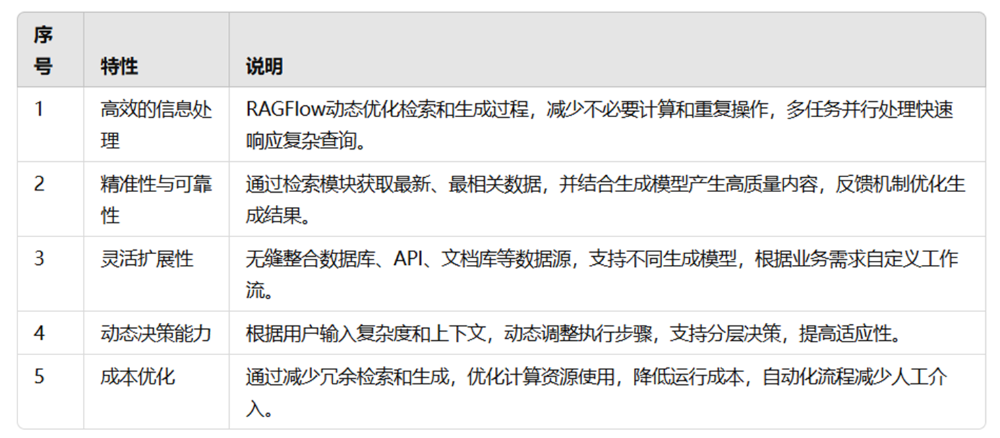

#### 与传统知识库产品的区别

与AnythingLLM等轻量化知识库应用相比，RAGFlow提供了**更深度、更细致的选项**，用户可以根据自己文档的情况做针对性调整：

- 除了Embedding Model，还可以选择Rerank Model
- 针对不同文档类型选择不同的切割方式
- 支持RAPTOR技术（递归抽象处理树状组织检索）
- 支持Self-RAG（自我反省机制）
- 提供丰富的API接口，可与其它Chatbot或Agent系统集成

### RAGFlow的适用场景

RAGFlow主要适用于需要**动态生成内容且依赖外部知识库**的场景，以下是一些典型应用领域：

1. 智能客服与虚拟助理

RAGFlow可以动态从知识库或数据库中提取与用户查询相关的信息，并生成精确、个性化的回答。例如电商平台的智能客服能够实时回答订单状态、产品信息或售后支持问题。

2. 文档生成与报告分析

能够从多个数据源中检索信息并生成结构化的文档或摘要，适合大规模内容管理。应用场景包括企业年报、市场调查报告、技术文档的自动生成等。

3. 实时数据分析与预测

结合实时数据检索与生成分析，帮助用户快速做出决策。例如金融机构实时生成投资分析报告，或电力系统监控数据生成维护建议。

4. 教育与科研辅助

为学生和研究人员提供快速、精准的知识支持，生成清晰的解释或推荐资源。例如智能辅导系统根据学生问题动态生成解题步骤或学习资源。

5. 医疗健康咨询

从医学知识库中提取诊疗信息，结合患者描述生成个性化建议。应用场景包括在线健康咨询平台动态生成诊断和护理建议。

6. 法律和合规支持

从法律文本或法规中提取相关条款，并生成具体解读或建议。例如法律咨询平台实时提供法规解读或合同条款优化建议。

7. 内容推荐与生成

根据用户偏好检索相关内容并生成推荐。例如新闻平台根据用户兴趣生成个性化推荐内容。

### RagFlow系统框架

#### 主要组件

**1. 核心处理模块（Answers）**

- **Answer**：生成最终答案的核心模块
- **Re-rank**：对检索结果进行重新排序
- **Multi-way Recall**：多路召回机制，可能结合多种检索方式
- **API Server**：提供系统对外接口
- **Query Analyze**：查询分析模块，解析用户问题
- **Task Dispatch**：任务调度器，分配处理任务
- **Keyword & Embedding**：关键词和向量嵌入处理
- **Tasks**：任务管理模块

**2. 数据接入层（Links）**

- **Web**：网页数据源接入
- **Nginx**：作为反向代理或静态文件服务器
- **File**：文件系统接入
- **Documents**：文档数据接入

**3. 文档处理流水线（Document Passer）**

- **OCR**：光学字符识别，处理扫描文档
- **Task Executor**：任务执行器
- **Chunk**：文档分块处理
- **Document Layout Analyze**：文档布局分析
- **Table Structure Recognition**：表格结构识别

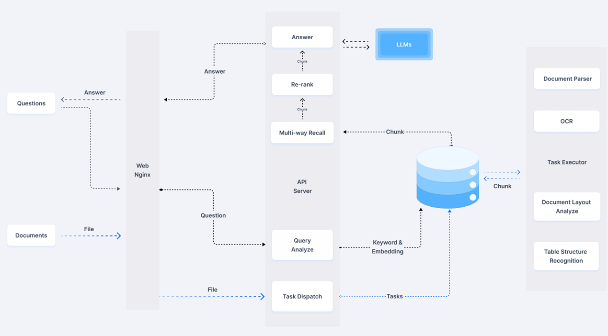

### 整体流程

1. **输入阶段**
   - 用户输入问题（Questions）和文档（Documents，可能是文件或网页）。
2. **文档处理阶段**
   - 文档通过解析器（Document Parser）处理，涉及OCR、布局分析、表格识别等步骤。
   - 文档被切分为小块（Chunk），存储到数据库中，作为知识库。
3. **问题处理阶段**
   - 用户问题通过API服务器（API Server）进入系统。
   - 问题经过查询分析（Query Analyze），提取关键词或生成嵌入（Keyword & Embedding）。
4. **检索阶段**
   - 使用多路召回（Multi-way Recall）从数据库中检索相关内容（Chunk）。
   - 召回结果通过重排序（Re-rank）优化，确保最相关的内容排在前面。
5. **答案生成阶段**
   - 重排序后的内容结合大语言模型（LLM）生成最终答案（Answer）。
   - 答案返回给用户。

接下来将详细介绍如何安装RagFlow

## RAGFlow安装指南

### 系统要求

在安装RAGFlow之前，请确保您的系统满足以下**最低要求**：

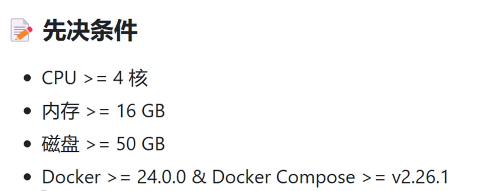

### RagFlow安装

RagFlow官方地址为：[https](https://github.com/infiniflow/ragflow)[://](https://github.com/infiniflow/ragflow)[github.com/infiniflow/ragflow](https://github.com/infiniflow/ragflow)

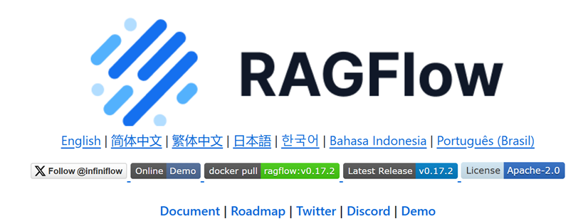

通过以下命令来克隆RagFlow项目

```bash
git clone https://github.com/infiniflow/ragflow
```

#### 检查环境

首先需要检查vm.max_map_count的值，确保其>=262144

```bash
sysctl vm.max_map_count
```

若不是的话则将其重置为262144

```bash
sudo sysctl -w vm.max_map_count=262144
```

此更改将在系统重启后重置。为了确保您的更改保持永久，请相应地在/etc/sysctl.conf中添加或更新该值：vm.max_map_count

```bash
vi /etc/sysctl.conf
```

然后修改 vm.max_map_count=262144

最终输入 "：wq!"   就可以保存退出了

#### 安装docker

若已经安装好了则可以跳过这一步

若尚未安装docker和docker compose，请按照以下步骤按照：

```Bash
# 更新包管理器
sudo apt-get update

# 安装Docker
sudo apt-get install docker.io

# 启动Docker服务
sudo systemctl start docker
sudo systemctl enable docker

# 安装Docker Compose
sudo curl -L "https://github.com/docker/compose/releases/download/v2.26.1/docker-compose-$(uname -s)-$(uname -m)" -o /usr/local/bin/docker-compose
sudo chmod +x /usr/local/bin/docker-compose
```

#### 启动RagFlow服务

```Bash
cd docker
chmod +x ./entrypoint.sh
docker compose up -d
```

注意：*核心镜像大小约为9GB，下载可能需要较长时间。*

#### 验证安装

检查服务状态以确保成功启动。

```Bash
docker logs -f ragflow-server
```

若出现以下输出则表示系统已经正常启动：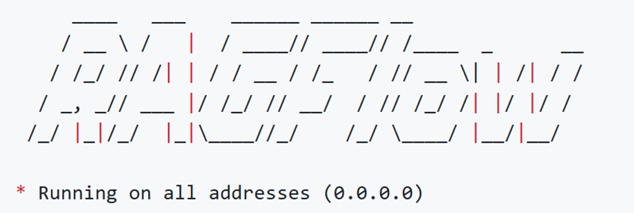

## 使用RagFlow

### 访问RagFLow

在浏览器中输入服务器IP地址（通常是http://localhost或http://您的服务器IP）访问RAGFlow Web界面。首次访问需要注册账号。

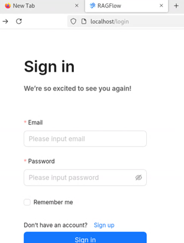

这里随便输入一个邮箱和密码就可以注册登录了，主界面如下

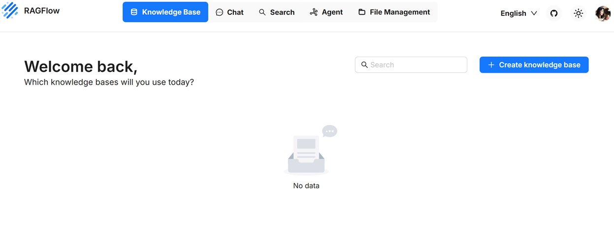

### 添加模型

首先在主界面点击自己的头像，然后选择模型提供商

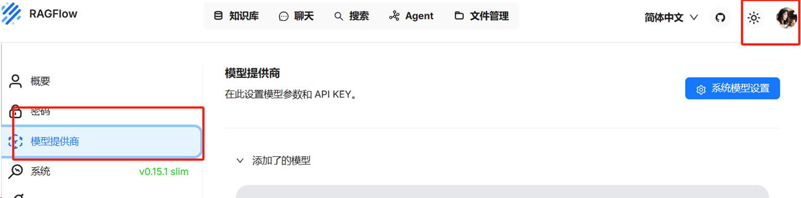

然后可以看到有很多待添加的模型，从这里我们可以直接调用API key来使用模型服务，例如以Deepseek模型为例，若添加不了大家可以试试其他模型，例如zhipu API。

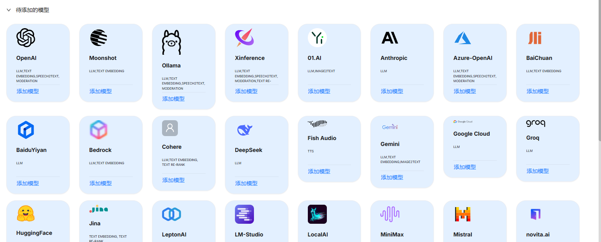

首先我们去Deepseek官网创建一个API key

网址：https://platform.deepseek.com/api_keys

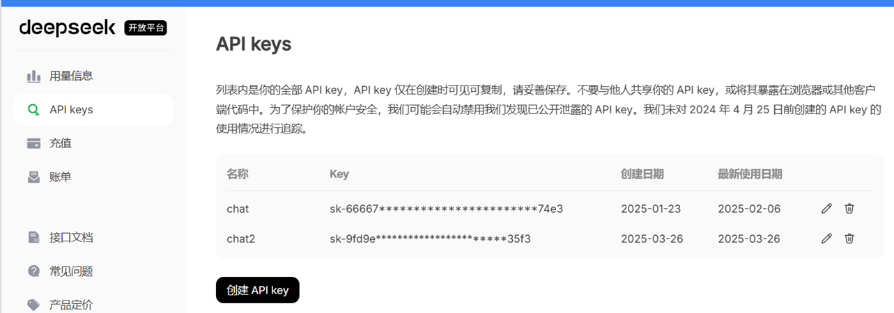

然后复制API到模型提供商中点击Deepseek添加模型：

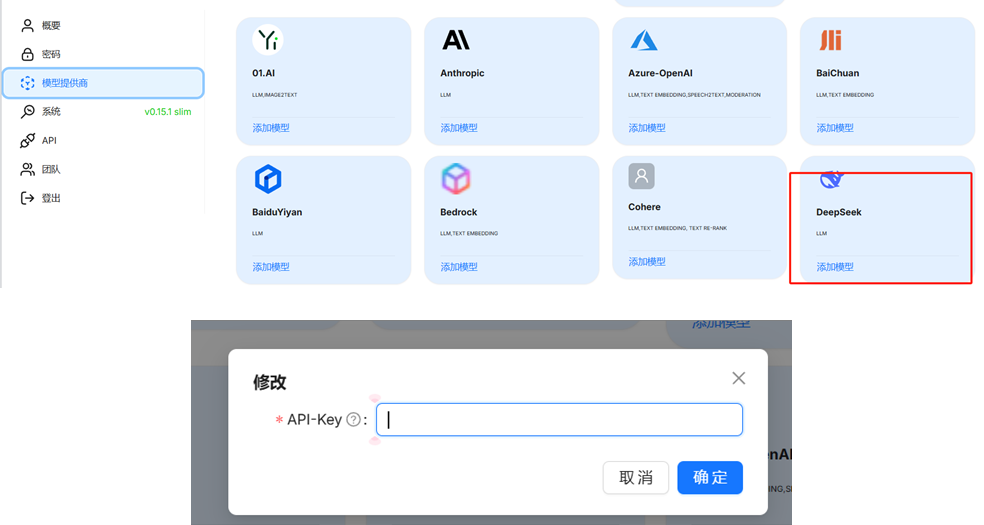


接着去系统模型设置聊天模型和Embedding模型：

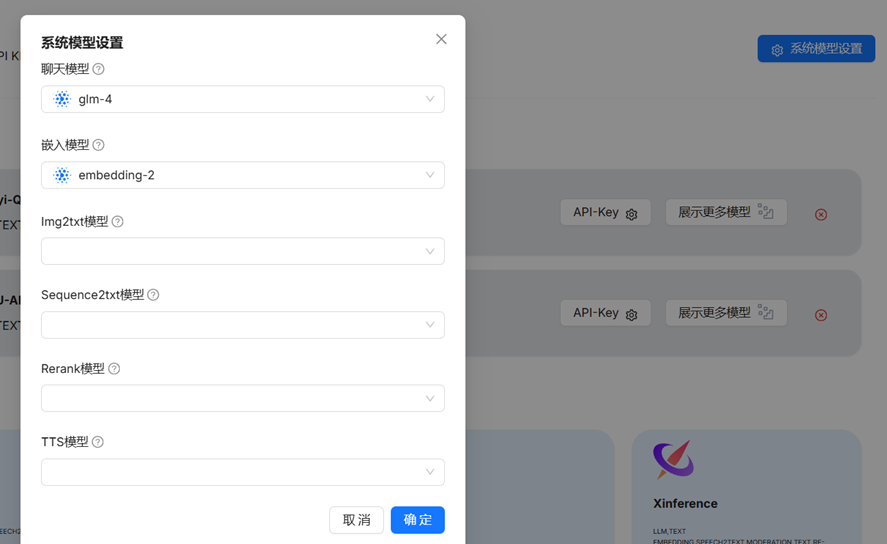

#### 使用Ollama加载本地模型

注意：若我们使用宿主机上的Ollama添加模型的话，首先要确保RagFlow是否能与Ollama上的基础URL能够正常连接。

若RagFlow和Ollama在同一台机器上运行，但RagFlow在docker内，所以

基础Url填写ollama所在服务器的ip，默认端口号为11434，http://<your ip>:11434 。

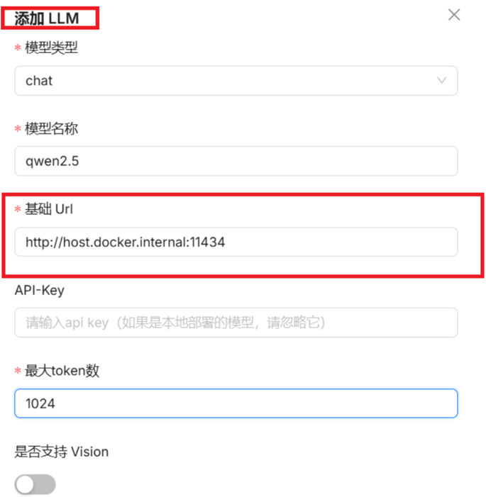

### 创建知识库

添加好模型后就可以创建知识库了：

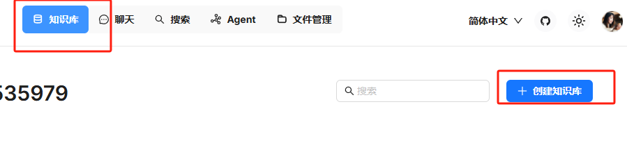

首先新建一个名字，然后设置嵌入模型还有解析方法

这里解析方法通常选General就行

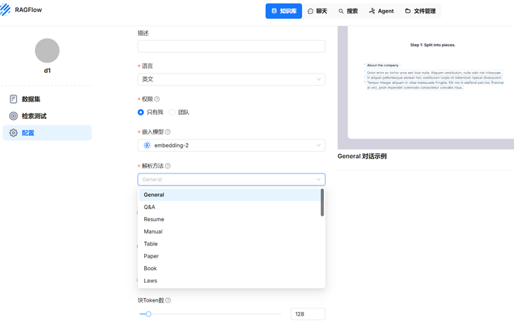

上传一个自己的知识库文件，然后选择解析，只有解析成功后才能使用知识库进行解答

注意：知识库文件尽可能为DOC，PDF等形式（可以参考前面的什么是RagFlow)

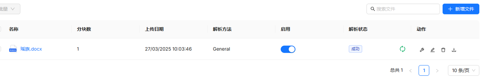

知识库内容如下：

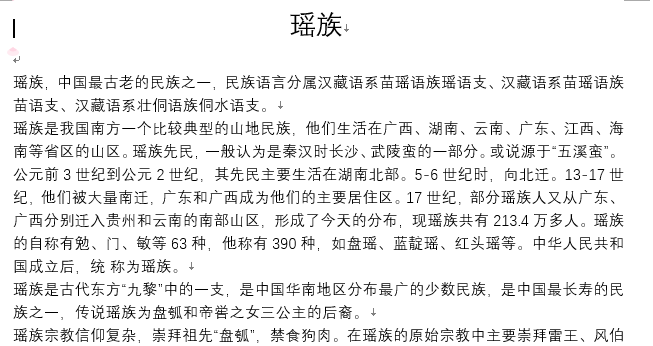

### 运用知识库的知识进行对话

在创建完模型和知识库后，我们需要去聊天中新建一个助理：

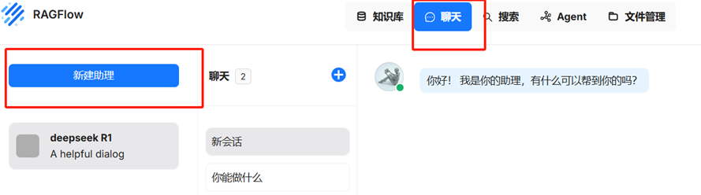

新建助理名字，然后选择刚刚定义好的知识库，最后在模型设置中查看自己设置的模型，点击确定就可以开始对话了

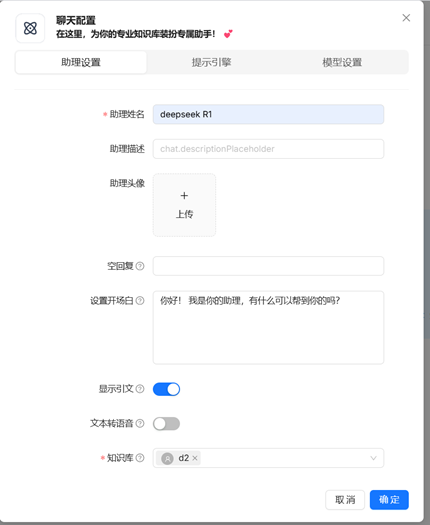

#### 对话效果：

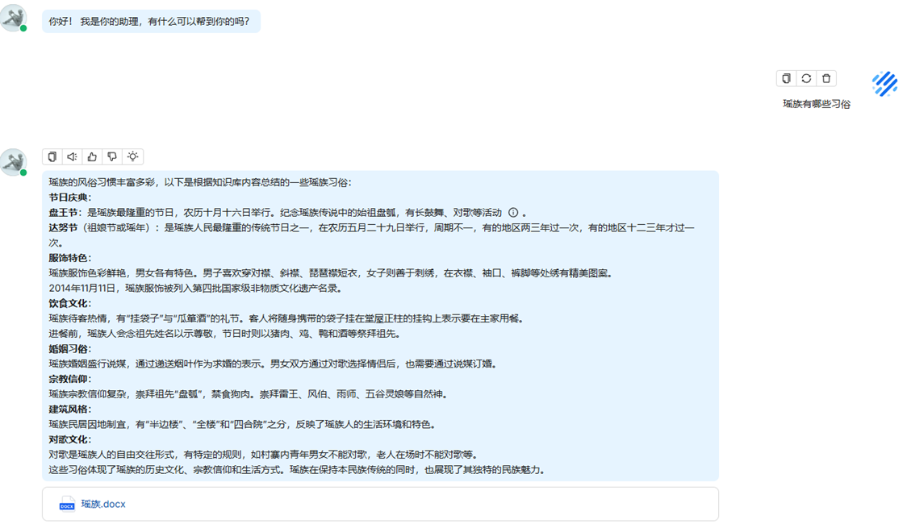