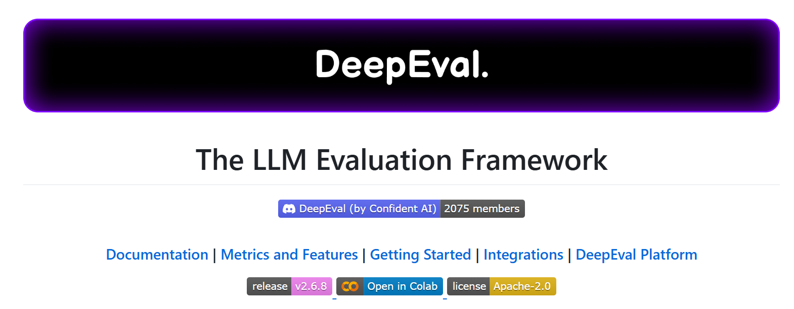
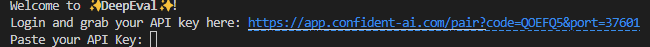
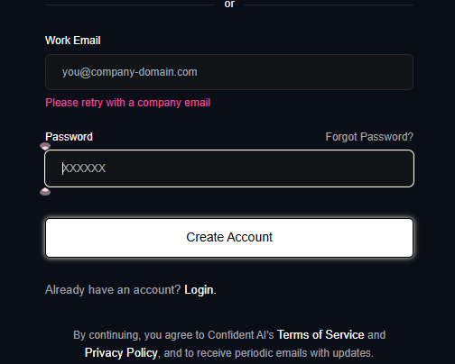
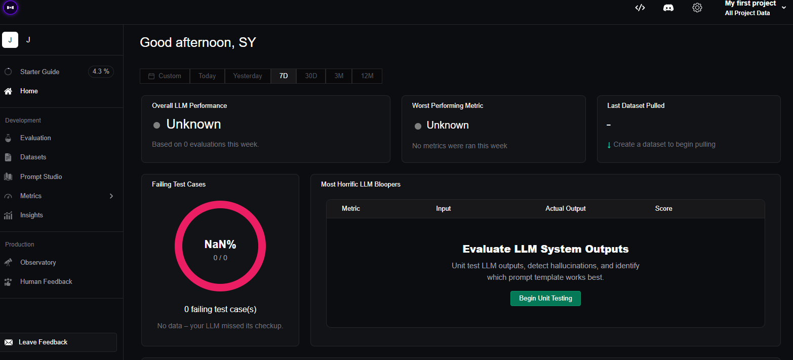
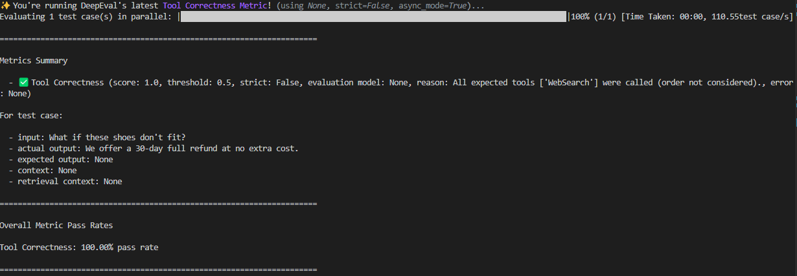
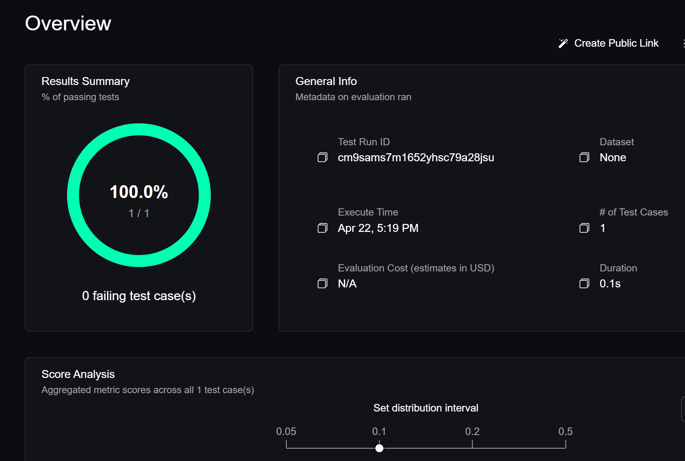
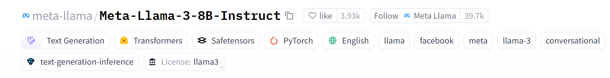
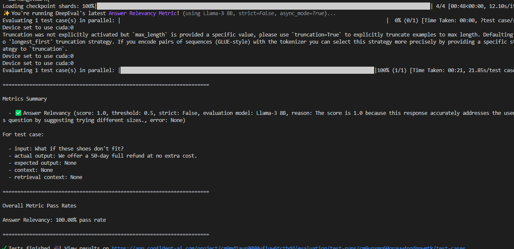
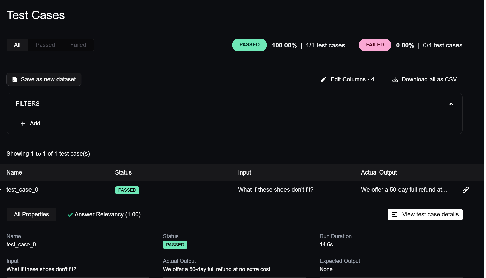

# 大模型评估框架-deepeval

### 项目介绍

深度评估（DeepEval） 是一个专为大型语言模型（LLM）输出评测设计的开源框架。它借鉴了Pytest的设计理念，但更加专注于单元测试LLM生成的答案，确保其质量符合预期标准。通过集成最新的研究，如G-Eval等评价方法，DeepEval提供了一系列指标来量化LLM响应的准确性、相关性和其他关键特性。此外，该框架具有高度模块化，便于使用者选择性地运用其内置指标，或是开发自定义评估逻辑，适用于多样化的应用场景。




项目地址为：

[confident-ai/deepeval: The LLM Evaluation Framework](https://github.com/confident-ai/deepeval?tab=readme-ov-file)


### 项目准备

首先去官网把项目克隆下来

```bash
git clone https://github.com/confident-ai/deepeval.git
# 移动到项目目录下
cd deepeval
```


创建一个虚拟环境，避免环境冲突

```bash
conda create -n deepeval python=3.10
```

按照必要依赖库：

```bash
pip install -U deepeval -i https://pypi.tuna.tsinghua.edu.cn/simple
```

**创建一个账户（可选）**

deepeval提供了一个平台，可以记录保存的测试结果，能够在迭代中跟踪性能表现。

登录网页：

```bash
deepeval login
```

然后在终端中就会给出一个网页：



打开网页后进行注册：

这里没有公司邮箱的话可以试试教育邮箱。

注册成功后会出现一些选项，例如需要做什么任务，测试哪些方面等

最后会给你一个API密钥，复制该密钥后将其粘贴到命令行，或者直接运行下面代码：

```bash
deepeval login --confident-api-key (yours API-KEY)
```

然后终端会给出一个网页端，打开网页就可以看到confidence AI的界面



## 调用openai-api测评

### 快速开始

创建一个测试文件：

```bash
touch test_chatbot.py
```

打开创建的文件，并写入使用deepeval测评框架的测评代码：

```Python
from deepeval import evaluate
from deepeval.test_case import LLMTestCase, ToolCall
from deepeval.metrics import ToolCorrectnessMetric

test_case = LLMTestCase(
    input="What if these shoes don't fit?",
    actual_output="We offer a 30-day full refund at no extra cost.",
    # Replace this with the tools that was actually used by your LLM agent
    tools_called=[ToolCall(name="WebSearch"), ToolCall(name="ToolQuery")],
    expected_tools=[ToolCall(name="WebSearch")],
)
metric = ToolCorrectnessMetric()

# To run metric as a standalone
# metric.measure(test_case)
# print(metric.score, metric.reason)

evaluate(test_cases=[test_case], metrics=[metric])
```

然后去openai官网获取API-KEY: [API Platform | OpenAI](https://openai.com/api/)

获取openai-API后将这个API设置到环境中：

```bash
export OPENAI_API_KEY="..."
```

最后在终端运行这个命令：

```bash
deepeval test run test_chatbot.py
```

运行结果如下图所示



其中：

​	变量input模仿用户输入，actual_output是聊天机器人基于此查询的预期输出的占位符。
​	变量retrieval_context包含来自您的知识库的相关信息，AnswerRelevancyMetric(threshold=0.5)是DeepEval提供的开箱即用的指标，它有助于根据提供的上下文评估您的LLM输出的相关性。
​	度量分数范围为0-1。threshold=0.5阈值最终决定您的测试是否通过。

测试运行结束后，在终端中会给出一个链接，将其打开到浏览器中可以看到结果：



## 加载本地模型测评

deepeval的所有评估指标都使用大语言模型（LLMs）进行评估，目前默认使用的是 OpenAI 的 GPT 模型。
 不过，对于不想使用 OpenAI GPT 模型的用户，`deepeval` 也提供了一种简单的方式，可以让任何人使用**几乎任意自定义的大语言模型**进行评估，比如 Claude（Anthropic）、Gemini（Google）、Llama-3（Meta）或 Mistral 等。

但是在进行LLM评估时要注意将模型的输出强制转化为JSON格式的输出，这样才能进行deepeval的测评。

接下来我们将以 Meta-Llama-3-8B-Instruct 模型为例，进行本地模型的测评；

### 下载模型

Meta-Llama-3-8B-Instruct 是 Meta 于 2024 年发布的 Llama 3 系列中一款中等规模的指令微调大语言模型，拥有约 80 亿参数，专为指令跟随任务（如问答、摘要、翻译、代码生成等）优化。该模型支持最长 128K 的上下文长度，并具备多语言处理能力。

在推理阶段，使用 bf16 精度时，**显存占用约为 17.9GB**；通过 4-bit 量化（如 BitsAndBytes）可将显存需求降至约 6–8GB，适合在消费级 GPU 上部署。

此外，模型文件大小约为 16GB。Llama-3-8B-Instruct 在多个基准测试中表现出色，性能优于前代的 Llama 2 70B 模型，适用于本地部署和多种 AI 应用场景。



由于国内网络从HF官网上下载速度较慢，所以在这里选择从摩达上下载该模型。

首先在终端运行：

```bash
pip install modelscope
```

创建一个文件夹用于存储模型文件；

```bash
mkdir Meta-llama3-8B-instruct
```

将模型下载到本地路径：

```bash
modelscope download --model LLM-Research/Meta-Llama-3.1-8B-Instruct --local_dir /root/Meta-llama3-8B-instruct 
```

由于开源的LLM通常需要限制输出格式为JSON才能进行deepeval的测试。

在官方提供的代码中，由于版本老旧的问题，在进行本地LLM测试的时候可能会遇到以下报错：

```bash
ValueError: Evaluation LLM outputted an invalid JSON. Please use a better evaluation model.
```

当用于评估的自定义 LLM 在metrics计算期间无法生成有效的 JSON 时，会出现此错误，这会导致评估过程完全停止。发生这种情况是因为，对于规模较小且功能较弱的 LLM，仅靠Prompt不足以强制实施 JSON 输出，而 deepeval的metrics恰好使用了 JSON 输出。

下面是修改后的代码：

首先安装一个依赖库

```bash
pip install lm-format-enforcer
```

然后新建一个py文件，将以下代码复制到其中：

```Python
import transformers
import torch
from deepeval.models import DeepEvalBaseLLM
from deepeval import evaluate
from deepeval.test_case import LLMTestCase, ToolCall
import json
from pydantic import BaseModel
from lmformatenforcer import JsonSchemaParser
from lmformatenforcer.integrations.transformers import (
    build_transformers_prefix_allowed_tokens_fn,
)
from transformers import BitsAndBytesConfig
from transformers import AutoModelForCausalLM, AutoTokenizer

from deepeval.metrics import ToolCorrectnessMetric, AnswerRelevancyMetric


class CustomLlama3_8B(DeepEvalBaseLLM):
    def __init__(self):
        quantization_config = BitsAndBytesConfig(
            load_in_4bit=True,
            bnb_4bit_compute_dtype=torch.float16,
            bnb_4bit_quant_type="nf4",
            bnb_4bit_use_double_quant=True,
        )

        model_4bit = AutoModelForCausalLM.from_pretrained(
            "/root/Meta-llama-3-8B-instruct", #将模型路径修改为你实际的路径
            device_map="auto",
            quantization_config=quantization_config,
        )
        tokenizer = AutoTokenizer.from_pretrained(
            "/root/Meta-llama-3-8B-instruct" ##将模型路径修改为你实际的路径
        )

        self.model = model_4bit
        self.tokenizer = tokenizer

    def load_model(self):
        return self.model
    def generate(self, prompt: str, schema: BaseModel) -> BaseModel:
        # Same as the previous example above
        model = self.load_model()
        pipeline = transformers.pipeline(
            "text-generation",
            model=model,
            tokenizer=self.tokenizer,
            use_cache=True,
            device_map="auto",
            repetition_penalty=1.2,
            temperature=0.9,
            max_length=2500,
            do_sample=True,
            top_k=5,
            num_return_sequences=1,
            eos_token_id=self.tokenizer.eos_token_id,
            pad_token_id=self.tokenizer.eos_token_id,
        )

        # Create parser required for JSON confinement using lmformatenforcer
        parser = JsonSchemaParser(schema.model_json_schema())
        prefix_function = build_transformers_prefix_allowed_tokens_fn(
            pipeline.tokenizer, parser
        )

        # Output and load valid JSON
        output_dict = pipeline(prompt, prefix_allowed_tokens_fn=prefix_function)
        output = output_dict[0]["generated_text"][len(prompt) :]
        json_result = json.loads(output)

        # Return valid JSON object according to the schema DeepEval supplied
        return schema(**json_result)

    async def a_generate(self, prompt: str, schema: BaseModel) -> BaseModel:
        return self.generate(prompt, schema)
       

    def get_model_name(self):
        return "Llama-3 8B"


# Initialize model
custom_llm = CustomLlama3_8B()
# If you want to use it for AnswerRelevancyMetric instead of ToolCorrectnessMetric, uncomment above

# Define test case
test_case = LLMTestCase(
    input="What if these shoes don't fit?",
    actual_output="We offer a 50-day full refund at no extra cost.",
    tools_called=[ToolCall(name="WebSearch"), ToolCall(name="ToolQuery")],
    expected_tools=[ToolCall(name="WebSearch")],
)

# Choose metric
metric = ToolCorrectnessMetric()
# If you want to test output relevance instead, use:
metric = AnswerRelevancyMetric(model=custom_llm)

# Run evaluation
evaluate(test_cases=[test_case], metrics=[metric])
```

运行结果如下图所示：



在量化后，显存占用约为8g


根据下方给出的链接我们可以看到测试的结果如下：

