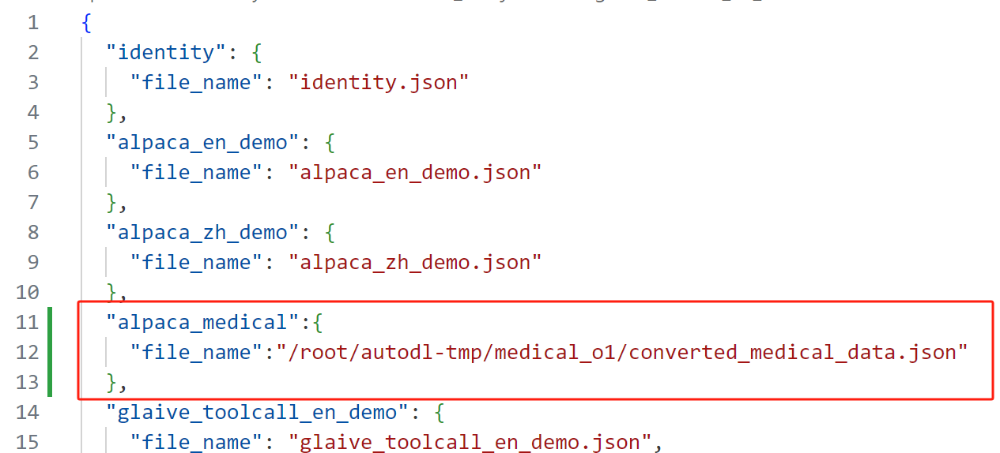
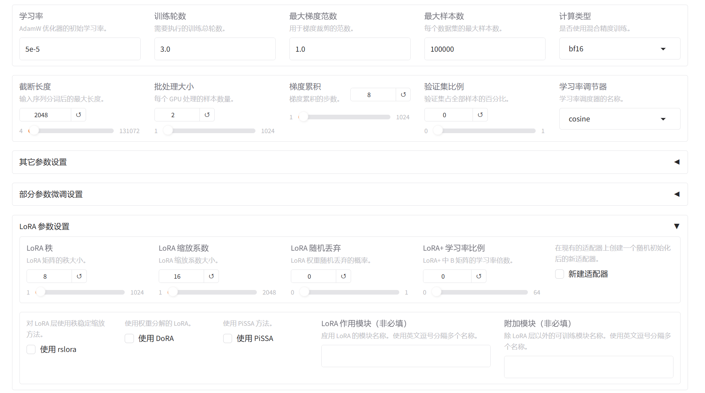

# 使用LLaMAFactory微调DeepSeek-R1蒸馏模型

LLaMA Factory 是一款开源的低代码大模型微调框架，集成了行业主流的微调技术，支持用户通过 Web UI 无需编写代码即可完成大模型微调。目前，它已成为开源社区中最受欢迎的微调框架之一，在 GitHub 上累积超过 4 万星标。本教程将基于深度求索公司开源的 **DeepSeek-R1-Distill-Qwen-7B**（该模型由 **DeepSeek-R1** 通过蒸馏 **Qwen2.5-Math-7B** 得到），介绍如何使用 **PAI 平台** 和 **LLaMA Factory** 训练框架进行大模型微调。

### 运行环境：


### 1 安装LLama-Factory

为了不造成环境冲突，建议先创建一个虚拟环境：

```
conda create llamafactory -n python=3.11
conda init
```

然后选择y 创建环境，创建好后激活环境：

```
conda activate llamafactory
```

创建好虚拟环境后，从LLama-Factory的github官网上下载项目

```
cd /root/autodl-tmp
git clone --depth 1 https://github.com/hiyouga/LLaMA-Factory.git
```

在安装依赖库时，可能会耗费一段时间，请耐心等待一下，也可以通过添加镜像源来加快下载速度：

```
pip install -e ".[torch,metrics]" -i https://pypi.tuna.tsinghua.edu.cn/simple
```

### 2 下载模型与数据集

#### 2.1 下载模型

为了方便演示，本案例使用的是DeepSeek-R1-Distill-Qwen-1.5B模型，大家可以根据自己实际显存大小选择合适的模型。

在下载前首先安装摩达库：

```
pip install modelscope
mkdir ./deepseek_distill_qwen1.5b
```

运行下面命令下载模型

```
modelscope download --model Qwen/Qwen2.5-0.5B-Instruct --local_dir /root/autodl-tmp/deepseek_distill_qwen1.5b
```

### 2.2 下载数据集

由于Deepseek-R1是一个带有推理链的模型，所以我们也要选择带有推理链的数据集。例如：

**medical-o1-reasoning-SFT**，该数据集用于微调 HuatuoGPT-o1，这是一个为高级医学推理设计的医学大语言模型。该数据集是通过 GPT-4o 构建的，GPT-4o 会搜索可验证的医学问题的解决方案，并通过医学验证器验证这些方案。


该数据集主要由三部分组成：Question，Complex_CoT，Response；

**Question**：医学领域的具体问题，通常需要深入理解和推理。

**Complex_CoT**：复杂的思维链（Chain-of-Thought），提供逐步推理的过程，展示从问题到答案的逻辑推导。

**Response**：最终的答案或解决方案。

数据集中的 Complex_CoT 与模型的推理能力直接对齐。通过微调，模型可以学习如何根据医学问题生成高质量的推理步骤，并最终输出准确的响应。这种结构化的输入-推理-输出的模式，能够充分利用模型的“think”特性，使其在推理任务中表现更优。

我们可以在摩达社区下载该数据集：[medical-o1-reasoning-SFT · 数据集](https://www.modelscope.cn/datasets/FreedomIntelligence/medical-o1-reasoning-SFT/files)

通过以下命令即可下载数据集，一共138MB：

```
modelscope download --dataset FreedomIntelligence/medical-o1-reasoning-SFT --local-dir /root/autodl-tmp/medical_o1
```

#### 2.3 数据处理

由于数据集的格式问题，我们需要将其处理为LLama-factory能处理的alpaca格式，本案例提供了转换代码以及转换后的数据集

```
import json

input_file = "/root/autodl-tmp/medical_o1/medical_o1_sft_Chinese.json"
output_file = "/root/autodl-tmp/medical_o1/converted_medical_data.json"

with open(input_file, "r", encoding="utf-8") as f:
    data = json.load(f)

converted_data = []
for item in data:
    converted_item = {
        "instruction": item["Question"],
        "input": "",
        "output": f"<think>{item['Complex_CoT']}<think>\n\n{item['Response']}"
    }
    converted_data.append(converted_item)

with open(output_file, "w", encoding="utf-8") as f:
    json.dump(converted_data, f, ensure_ascii=False, indent=4)

print(f"{output_file}")

```

处理后数据格式如下：


处理完数据格式后，我们需要将自己的数据集注册到LLamafactory的数据集库中。

该数据集库位置如下：/root/autodl-tmp/LLaMA-Factory/data/dataset_info.json


然后在文件开头处添加以下代码：

```
  "alpaca_medical":{
    "file_name":"/root/autodl-tmp/medical_o1/converted_medical_data.json"
  },
```



### 3 使用LLamaFactory-webui

我们在前面已经成功下载了LLamaFactory，直接通过以下命令进入WebUI界面

```
llamafactory-cli webui
```

成功启动后界面如下：


首先，导入前面已经下载好的模型，

选择zh(中文)，模型名称（DeepSeek-R1-1.5B-Distill）模型的本地路径（/root/autodl-tmp/deepseek_distill_qwen1.5b）


然后选择数据集，这里选择自己的注册的数据集：


在这里可以设置默认的超参数也可以自行调整合适的训练参数例如：LORA秩、LORA缩放系数、学习率等。



选择模型的结构保存路径，然后就可以开始训练了。

可以在WebUI上看到实时的训练进度：


在我们指定的保存路径下可以看到每个检查点保存的模型权重：

/root/autodl-tmp/LLaMA-Factory/saves/DeepSeek-R1-1.5B-Distill/lora/train_2025-03-11-09-34-37/checkpoint-2000


选择检查点路径导入微调后的模型参数


选择加载模型后即可与微调后的模型进行对话：

当对话完成后记得卸载模型，释放显存。


