# Deepseek大模型评测

近年来，随着人工智能技术的飞速发展，大模型在自然语言处理、知识推理、代码生成等多个领域展现出强大的能力。为了全面评估这些模型的性能，学术界和工业界提出了多种评测方法和数据集。本文旨在综述大模型评测的理论基础、常用数据集及其应用场景，并结合实际案例探讨不同模型的表现差异。

### 1.大模型测评理论介绍

目前市面上已经开源了很多大模型，同时也有很多大模型工具可以供我们使用，但面对如此之多的大模型，哪些大模型更强？我们怎么选择最适合自己的大模型呢？

#### 1.1 大模型排行榜

面对市场上超过80种不同的大模型，确定哪一个是最符合自己的需求的选择成为了首要难题。

例如，阿里云的通义千问、百度的文心一言等都是目前比较知名的产品，但它们各自擅长的领域、性能特点可能有所不同。这就需要我们从技术背景、应用场景等多个维度进行全面考量，才能找到最适合自身需求的那个。

全球知名的AI模型评测平台**ChatbotArena**（大模型竞技场）（[Chatbot Arena Leaderboard - a Hugging Face Space by lmarena-ai](https://huggingface.co/spaces/lmarena-ai/chatbot-arena-leaderboard)）公布了最新一期榜单（Chatbot Arena LLM Leaderboard）。

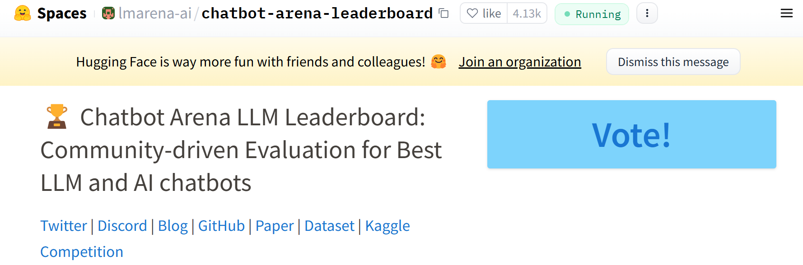

这是业界公认的最公正、最权威榜单之一，采用匿名方式将大模型两两组队，交给用户进行盲测（提出任何相同问题），根据真实对话体验对模型能力进行投票。如果一次回答不能确定，用户可以继续聊天，直到确定获胜者；如果在对话中透露了模型的身份，则不会计算投票。

在最新的榜单上可以看到近期最新大模型能力的排名，其中由马斯克旗下的xAI研发的Grok3与OpenAI近期发布的GPT4.5并列第一，比较热门的国产大模型Deepseek R1也排到了第七名的成绩。

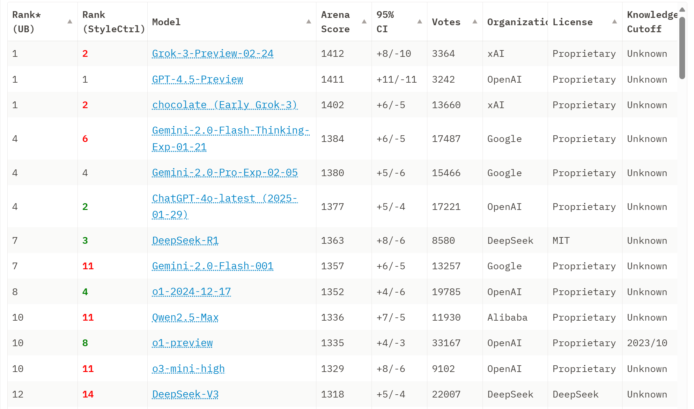

这些排名更多的是注重于大模型综合的实力，不同的用户需求不同对大模型的能力要求也不同。其中，“大湾区生成式人工智能安全发展联合实验室”全国首发“大模型可信能力评测排行榜”（[重磅！“大模型可信能力评测排行榜”全国首发_南方网](https://news.southcn.com/node_54a44f01a2/17c73993d8.shtml)），这个排行榜从价值对齐评测，安全可控评测，能力可靠评测几个方面来评估大模型的能力。根据这个排行榜，我们可以更好地找到合适的大模型。

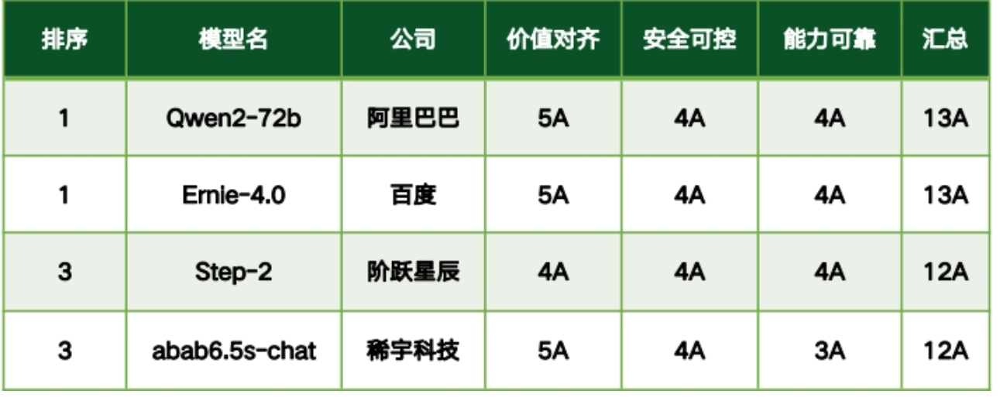

#### 1.2 大模型测评常用数据集介绍与对比

**中文常用数据集：**

**C-Eval**（[C-Eval: A Multi-Level Multi-Discipline Chinese Evaluation Suite for Foundation Models](https://cevalbenchmark.com/)）是一个全面的中文基础模型评测数据集，它包含了 13948 个多项选择题，涵盖了 52 个学科和四个难度级别。

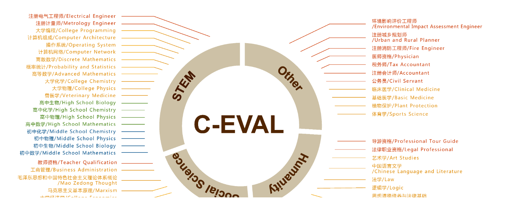

**CMMLU**（[haonan-li/CMMLU: CMMLU: Measuring massive multitask language understanding in Chinese](https://github.com/haonan-li/CMMLU)）是一个综合性的中文评估基准，专门用于评估语言模型在中文语境下的知识和推理能力。CMMLU涵盖了从基础学科到高级专业水平的67个主题。它包括：需要计算和推理的自然科学，需要知识的人文科学和社会科学,以及需要生活常识的中国驾驶规则等。此外，CMMLU中的许多任务具有中国特定的答案，可能在其他地区或语言中并不普遍适用。因此是一个完全中国化的中文测试基准。

[CMMLU](https://cloud.tencent.com/developer/tools/blog-entry?target=https%3A%2F%2Fgithub.com%2Fhaonan-li%2FCMMLU&objectId=2379575&objectType=1&isNewArticle=undefined) 是一个包含了 67 个主题的中文评测数据集，涉及自然科学、社会科学、工程、人文、以及常识等，有效地评估了大模型在中文知识储备和语言理解上的能力。

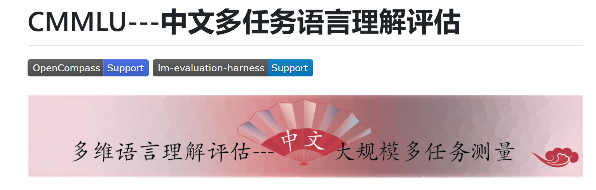

**SuperCLUE**（[CLUEbenchmark/SuperCLUE: SuperCLUE: 中文通用大模型综合性基准 | A Benchmark for Foundation Models in Chinese](https://github.com/CLUEbenchmark/SuperCLUE)）是一个综合性大模型评测基准，本次评测主要聚焦于大模型的四个能力象限，包括语言理解与生成、专业技能与知识、Agent智能体和安全性，进而细化为12项基础能力。

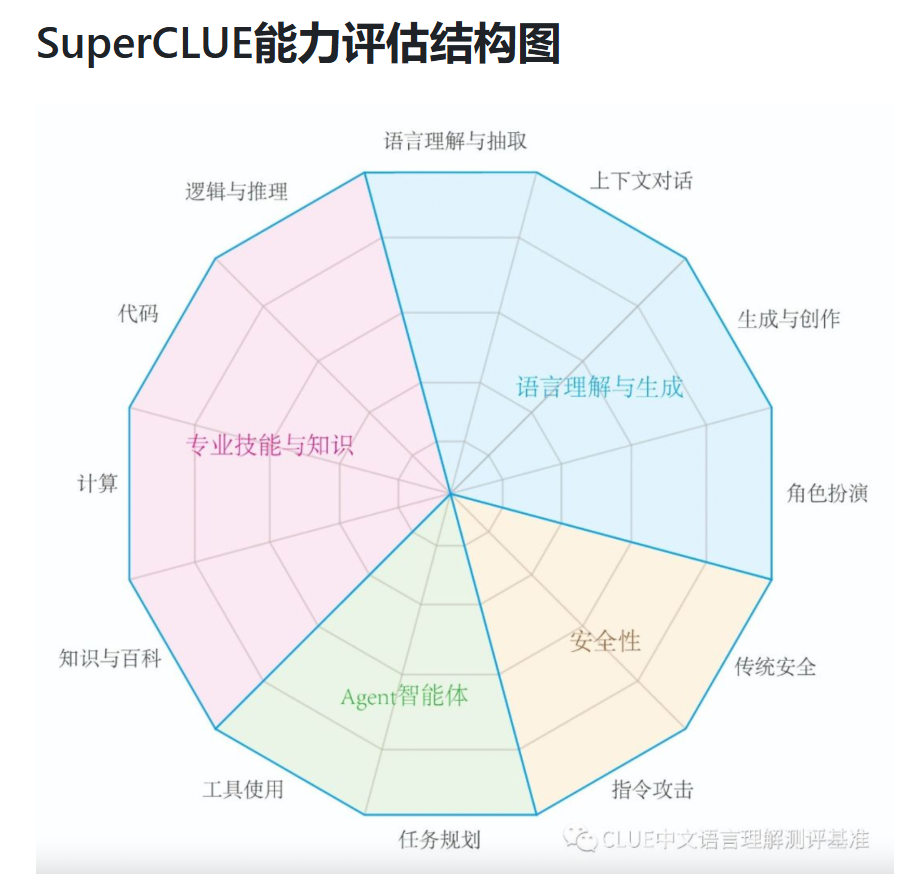

**GAOKAO**([OpenLMLab/GAOKAO-Bench: GAOKAO-Bench is an evaluation framework that utilizes GAOKAO questions as a dataset to evaluate large language models.](https://github.com/OpenLMLab/GAOKAO-Bench))是一个中国高考题目的数据集，旨在直观且高效地测评大模型语言理解能力、逻辑推理能力的测评框架。

收集了2010-2022年全国高考卷的题目，其中包括1781道客观题和1030道主观题，构建起GAOKAO-bench的主要评测数据。同时评测分为两部分，自动化评测的客观题部分和依赖于专家打分的主观题部分，这两部分结果构成了最终的分数，您可以通过构建示例中的脚本快速对一个已部署的大模型进行评测，或者向我们提交您需要评测的模型的主观题预测结果，进行我们人工评分的流水线操作。所有过程的数据和结果都是公开的。

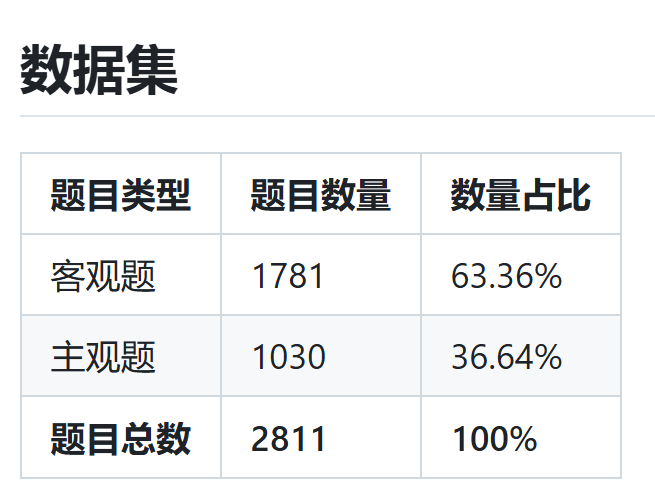

**英文数据集：**

MMLU（[MMLU Dataset | Papers With Code](https://paperswithcode.com/dataset/mmlu)）（大规模多任务语言理解）是一种新的基准测试，旨在通过仅在零样本和少样本设置中评估模型来衡量预训练期间获得的知识。包含了 57 个子任务的英文评测数据集，涵盖了初等数学、美国历史、计算机科学、法律等，难度覆盖高中水平到专家水平，有效地衡量了人文、社科和理工等多个大类的综合知识能力。

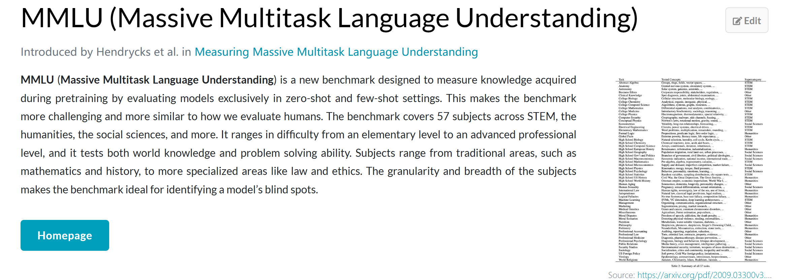

GSM8K（[openai/gsm8k · Datasets at Hugging Face](https://huggingface.co/datasets/openai/gsm8k)）（小学数学 8K）是一个包含 8.5K 高质量语言多样化小学数学单词问题的数据集。创建该数据集是为了支持对需要多步骤推理的基本数学问题进行问答的任务。这是一个高质量的英文小学数学问题测试集，包含 7.5K 训练数据和 1K 测试数据。这些问题通常需要 2-8 步才能解决，有效评估了数学与逻辑能力。

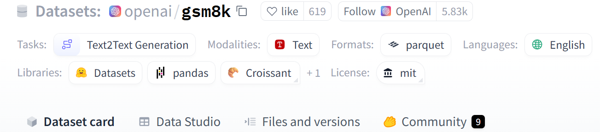

**WinoGrande**（[allenai/winogrande · Datasets at Hugging Face](https://huggingface.co/datasets/allenai/winogrande)） 是 44k 问题的新集合，受 Winograd Schema Challenge（Levesque、Davis 和 Morgenstern 2011）的启发，进行了调整以提高针对数据集特定偏差的规模和鲁棒性。表述为带有二元选项的填空任务，目标是为需要常识推理的给定句子选择正确的选项。

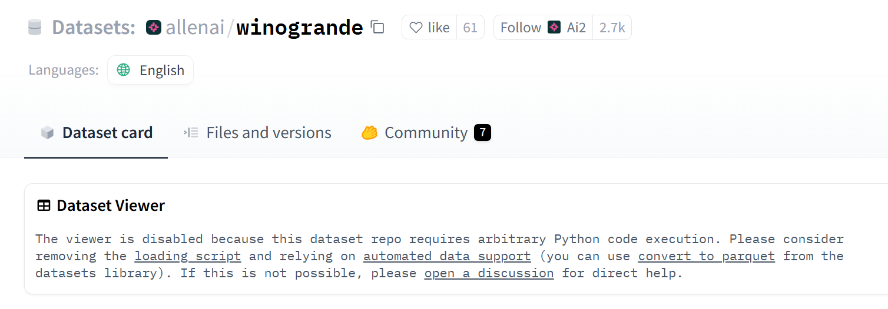

**MBPP**（https://huggingface.co/datasets/mbpp），该基准测试由大约 1,000 个众包 Python 编程问题组成，旨在由入门级程序员解决，涵盖编程基础知识、标准库功能等。每个问题都由任务描述、代码解决方案和 3 个自动化测试用例组成。

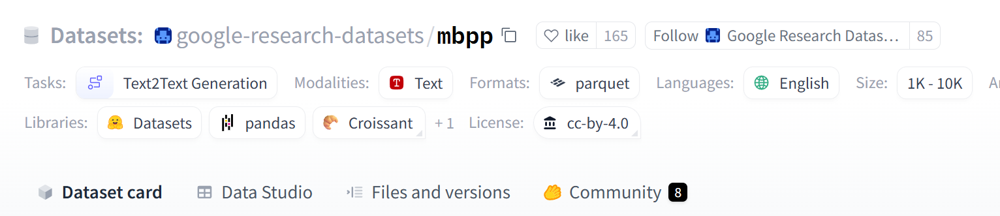

#### 1.3 MMLU大模型测评原理

"MMLU" （[hendrycks/test: Measuring Massive Multitask Language Understanding | ICLR 2021](https://github.com/hendrycks/test/tree/master)）是一项用于衡量大语言模型性能的指标，它代表着“Mean Multi-Language Understanding”，中文意为“多语言理解均值”。MMLU 的概念是在评估大型语言模型（如 GPT）在多语言环境中的表现时引入的，旨在更全面地考察模型对不同语言的理解能力。

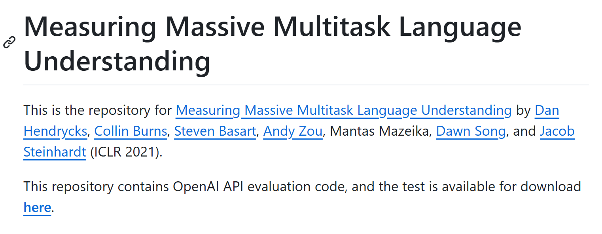

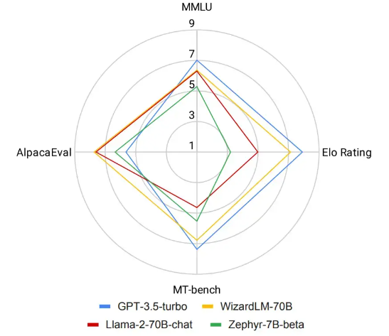

MMLU 的计算方法涉及多语言任务的性能评估，通常包括文本分类、命名实体识别、语言模型等多个领域。为了计算 MMLU，首先需要在各个任务上评估模型的性能，并获得相应的准确率、召回率、F1 分数等指标。然后，针对每种语言，计算模型在相应任务上的性能均值。最后，将所有语言的均值进行加权平均，以得到全局的 MMLU。举例来说，假设有一个大型语言模型在英语、中文和西班牙语上进行了文本分类任务的评估。模型在英语上的准确率为0.85，中文为0.78，西班牙语为0.80。那么，MMLU 就是这三个语言准确率的加权平均值。如果英语、中文和西班牙语的权重分别为0.4、0.3和0.3，那么 MMLU 就是 0.4 * 0.85 + 0.3 * 0.78 + 0.3 * 0.80 = 0.812。

#### 1.4 MMLU特点及应用场景

- **多学科覆盖**：MMLU的广泛学科覆盖使其能够全面评估模型的知识广度和深度，而不仅仅是单一领域的能力310。
- **高阶推理要求**：许多题目不仅测试模型的知识记忆能力，还要求其进行逻辑推理和问题解决，从而更真实地反映模型的实际应用能力310。
- **区分度高**：由于题目设计复杂且涵盖广泛，MMLU能够有效区分不同模型的能力水平，尤其是在高阶推理任务上310。
- MMLU广泛应用于学术界和工业界，用于评估和比较不同大模型的性能。例如，GPT-4、DeepSeek-R1等模型都在MMLU上进行了测试，以展示其在多任务语言理解上的表现310。

### 2.Deepseek系列模型及其性能对比

DeepSeek 由国内大模型公司 “深度求索” 开发，自 2023 年 7 月成立以来，推出的一系列模型在 AI 领域掀起了巨大波澜。尤其是在与国际知名模型的对比中，DeepSeek 展现出了强大的竞争力，让世界看到了中国 AI 技术的崛起。其不仅在技术指标上表现出色，在实际应用场景中也展现出了巨大的潜力，为各行各业的发展提供了新的助力。这也使得人们对 DeepSeek 的各个版本充满了好奇，不同版本的 DeepSeek 究竟有着怎样的特点与差异呢？

DeepSeek 语言模型从 V1 到 R1 不断演进，性能持续提升。**V1** 作为首款产品，具备基础编码与文本处理能力。**V2** 系列优化架构，提高文本生成与代码生成质量，并降低使用成本。**V2.5** 在数学、编码和推理能力上显著增强，支持联网搜索。**V3** 拥有 671 亿参数，在知识问答、长文本处理和代码生成等方面表现卓越，速度提升 3 倍，并支持本地部署。**R1** 专注推理能力，采用强化学习训练，在数学、代码推理等任务上表现突出，推动 AI 技术发展。

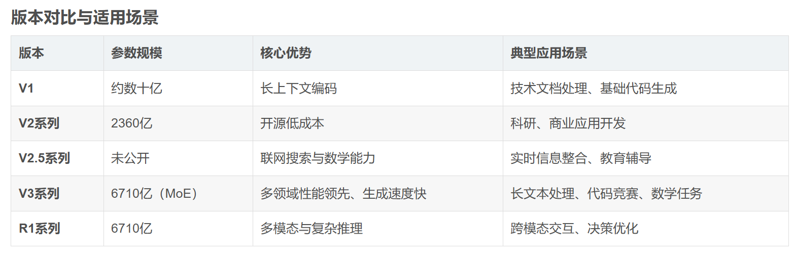

其中，Deepseek R1是一个系列的开源大模型，其拥有多个蒸馏版本：1.5B，7B，8B，14B，32B，70B，671B。这些不同版本的区别在于 

1. **参数规模**

   - **1.5B / 7B / 8B**：适用于本地部署，资源消耗低，适合轻量级任务
   - **14B / 32B**：更强的推理能力，适用于更复杂的任务（如代码补全、数据分析）
   - **70B / 671B**：更接近 GPT-4 级别，能进行更复杂的推理和决策

2. **推理速度和部署成本**

   - **1.5B/7B/8B** 可在 **消费级 GPU**（如 RTX 3090、4090）上运行
   - **14B/32B** 需要 **更高端的 GPU（A100/H100）**
   - **70B/671B** 主要面向 **大规模云端推理**

3. **适用场景**

   - **1.5B/7B/8B**：轻量级 AI 助手、智能问答、本地 AI

   - **14B/32B**：代码生成、复杂问答、知识推理

   - **70B/671B**：高级 AI 助手、科研分析、数据挖掘

     

### evalscope

 操作文档：[evalscope/README_zh.md at main · modelscope/evalscope](https://github.com/modelscope/evalscope/blob/main/README_zh.md)

[可视化 | EvalScope](https://evalscope.readthedocs.io/zh-cn/latest/get_started/visualization.html)

测试eval:/home/jiangsiyuan/eval_llm/evalscope/eval2.py

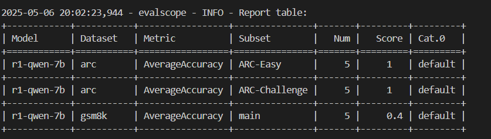

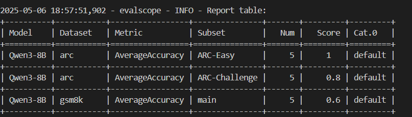

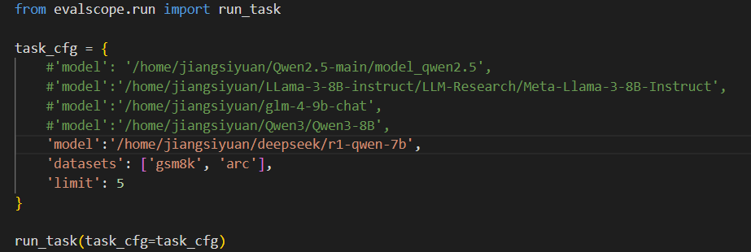

--datasets： 数据集（可以从modelscope中下载，支持的数据集有：[支持的数据集 | EvalScope](https://evalscope.readthedocs.io/zh-cn/latest/get_started/supported_dataset.html#id1)）

--limit: 每个数据集测试的个数

可视化：evalscope app --server-port 8050

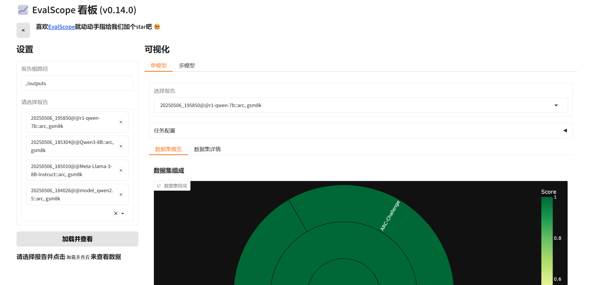
